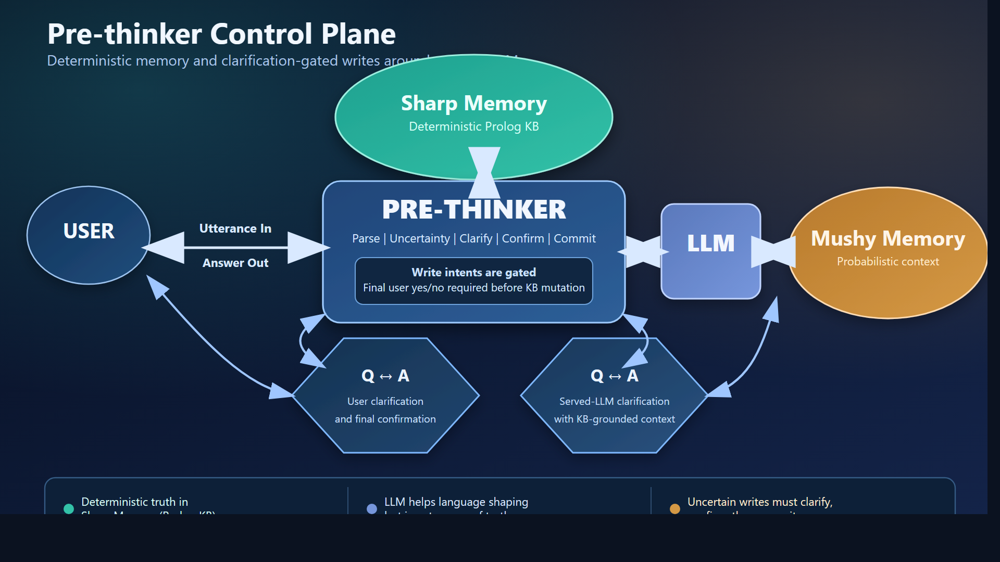

# Prethinker Explainer (Fresh Draft)

## What We Are Building

Prethinker is a control plane that sits in front of an LLM and protects deterministic memory.

Its job is narrow and strict:

- read human language
- extract machine-usable intent
- decide whether it is safe enough to write
- mutate/query Prolog state only through governed paths

This project is not about making a friendlier chatbot.  
It is about making a safer thinking boundary.

## Core Idea

We call the pattern a **Governed Intent Compiler**.

Natural language is treated like source text.  
Prethinker compiles it into structured operations:

- `assert_fact`
- `assert_rule`
- `query`
- `retract`
- `other`

Then policy decides what happens next.

## Contract

**The LLM proposes. The runtime decides.**

More concretely:

1. Parser proposes a structured JSON interpretation.
2. Pipeline validates and normalizes it.
3. Policy classifies risk/uncertainty.
4. If safe and authorized, deterministic runtime applies it.
5. If not safe, Prethinker clarifies or refuses.

## Why This Exists

Fluent LLM output is not the same as reliable memory mutation.

For fact-sensitive workflows, we need:

- deterministic state
- reversible updates
- auditable trace of every write
- explicit handling of ambiguity

Prethinker is the layer that enforces that discipline.

## The Memory Split

The architecture intentionally separates two memory modes:

- **Sharp memory**: Prolog KB (deterministic, auditable, queryable)
- **Mushy memory**: served LLM context (helpful, probabilistic, non-authoritative)

Sharp memory is truth authority.  
Mushy memory is advisory context.

## Clarification Philosophy

Clarification is not a side feature; it is the safety mechanism.

When uncertainty is high, Prethinker asks for clarity before writes.
This is controlled by CE (Clarification Eagerness):

- higher CE: ask sooner
- lower CE: commit sooner

Write operations can also require explicit user confirmation (`go/no-go`) before mutation.

## Served LLM Role (Strictly Limited)

The served LLM can help with language shape and candidate interpretation, especially for messy phrasing and pronouns.

But it is not trusted as an authority:

- it can suggest
- it cannot commit
- it cannot silently override policy
- it cannot create certainty by itself

User confirmation remains the final gate for writes when enabled.

## Voice Model

Prethinker is intentionally robotic.

- brief
- precise
- non-social
- no fluff

That is by design. It is an instrument voice, not a companion voice.

If a friendlier surface is desired, that can be layered later as presentation, while canonical semantics stay unchanged.

## Pipeline Shape

Main orchestrator: `kb_pipeline.py`  
Runtime engine: `engine/core.py`

Flow:

1. route + extract
2. validate + repair if needed
3. score uncertainty
4. run policy gate (`commit`, `stage_provisionally`, `ask_clarification`, `escalate`, `reject`)
5. apply deterministic operation (or block)
6. record provenance + validation outputs

## Evaluation Strategy

Rungs are used as progressive pressure, not vanity scores.

Two dimensions:

- logic height (facts -> rules -> chains -> corrections)
- language width (paraphrase, inversion, noisy phrasing, pronouns, missing punctuation)

The objective is not "100% once."  
The objective is sustained performance as test pressure expands.

## Golden KB Direction

When a scenario is rigorously validated, its resulting KB can be frozen as a golden target.

Then future runs can be scored against expected end-state quickly and deterministically.

This speeds iteration without removing rigor.

## What Is Strong Right Now

- clear separation between neural parsing and symbolic authority
- deterministic local runtime integration
- policy-gated clarification path
- strong run provenance and reportability
- growing cross-domain rung battery

## Evidence Publishing Model

The project keeps two evidence views on purpose:

- full run history in `kb_runs/` for deep audit and trend analysis
- curated published slice in docs (`docs/data/runs/`) for signal-first public reporting

Historical counters on the docs hub are computed from the full corpus, while the explorer table stays intentionally bounded so reporting remains readable.

## What Is Hard Right Now

- pronoun/coreference across turns
- high-noise language while preserving exact predicate intent
- balancing throughput vs clarification friction
- preventing subtle wrong writes under confidence illusions

## Project Posture

Prethinker is a serious research workbench in active evolution.

It is already useful for controlled domains and disciplined experimentation.
It is not presented as a universal, final semantic parser.

## Founder Lens

I did not build this to make a chat persona. I built it to protect truth in memory.

When language is fuzzy, people still need reliable state. Prethinker is the boundary
that slows the system down just enough to ask the right question before writing
something wrong forever.

If it sometimes feels strict, that is the point. Fluency is cheap; accountable memory is not.

## Diagram

