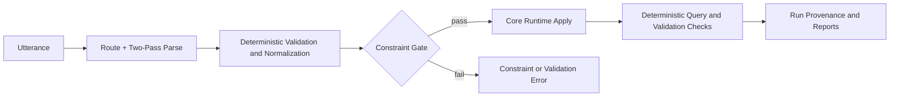

# Prethinker Semantic Parser Workbench

This project is a local workbench for building a high-accuracy semantic parser (Qwen 3.5 9B first) that converts natural language into Prolog-ready logic and applies it into named, persistent knowledge bases.

Last updated: 2026-04-12

## Quick Links

- docs hub: `docs/index.html`
- run explorer: `docs/run-reports-hub.html`
- explainer article: `EXPLAINER.md`
- assembly log: `SESSIONS.md`

## Repository Status Note

This repository is new. Core reasoning components (especially the Prolog engine/runtime) were migrated from prior work with an existing unit test history. Test migration is in progress; current status and run-by-run learnings are tracked in:

- `docs/run-learnings.md`
- `SESSIONS.md`

## Story Roundtrip Demo

Watch the pre-thinker consume a story, then recite from captured facts and logical memory.

- Demo page: `docs/goldilocks-roundtrip.html`
- Includes:
  - input story text
  - expandable generated `kb.pl`
  - reconstructed story generated from KB clauses alone

## Honest Snapshot (For NSAI Readers)

Prethinker is a neuro-symbolic parsing workbench, not a finished parser product.

- Problem focus: map free-form language into executable symbolic operations (`assert_fact`, `assert_rule`, `query`, `retract`) and apply them deterministically to persistent KBs.
- Core approach: hybrid pipeline where the model proposes structure, then deterministic runtime logic refines, validates, and applies through local runtime tools.
- What is solid today: architecture, provenance, prompt/version lineage, scenario ladder, and observability (`kb_runs` + HTML docs/report views).
- What is not proven yet: broad generalization on hard inputs (transitivity, quantifiers, negation policy, pronoun ambiguity, unseen vocabulary).
- Current evidence level: stronger than initial smoke stage; frontier now includes story/CE and progress-memory rungs through `rung_420`, but domain breadth and long-tail language still need expansion.

This is an open research effort and learning artifact, not a startup pitch.
If you're evaluating it as a research workbench, it's useful now. If you're evaluating it as production-grade semantic parsing, it's still early.

## Recent Progress (2026-04-10)

- Completed an autonomous safe-mode tuning campaign (scratch/output isolated under `tmp/`).
- Hardened system prompt rules for:
  - interrogative routing to `query`
  - yes/no query shape (no bare atom goals)
  - retract shape (`retract(<fact_like_term_with_args>).`)
- Added explicit micro-patterns for ambiguous undo/retract and yes/no status queries.
- Latest tuned prompt provenance in those runs: `sp-e0a66d9a2fbe`.
- In the final verification sweep (`resume5`), all targeted probes/rungs passed:
  - `stage_00_foreign_unseen_probe`
  - `stage_00_multilingual_probe`
  - `stage_01_facts_only`
  - `stage_02_rule_ingest`
  - `stage_03_transitive_chain`
  - `acid_03_temporal_override`
  - `acid_04_alias_pressure`
  - `acid_05_long_context_lineage`
- Evidence artifacts for this cycle are currently in `tmp/runs/` (for example `tmp/runs/resume5_summary_20260410_102508.json`) and can be promoted into `kb_runs/` + docs manifests in a publish pass.
- Fresh CE sweep (higher-target stability run) confirmed no plateau:
  - CE values tested: `0.55`, `0.65`, `0.75`, `0.85`
  - all 8 target scenarios passed at every CE setting
  - clarification rounds improved at lower CE (`0.55` produced `2` total rounds vs `4` at `0.65+`)

## Latest Status Rollup (2026-04-12)

- Prompt provenance for this cycle remained stable at `sp-1e43c641b01b` (pipeline/runtime changes, not SP changes).
- Clean-root ladder verification reached `100%` on `stage_01 -> rung_200` (`53/53` scenarios in that sweep).
- Added and validated higher frontier story/clarification rungs:
  - `rung_270_story_lineage_fragmented_ingest`
  - `rung_280_story_revision_temporal_shift`
  - `rung_290_story_multi_branch_pronoun_pressure`
  - `rung_300_story_nested_corrections`
  - `rung_310_story_cross_clause_pronoun_weave`
  - `rung_320_story_temporal_exception_rebinding`
  - `rung_330_story_booklet_cross_scene_rebind`
  - `rung_340_ce_story_pronoun_transfer`
  - `rung_350_ce_story_multi_round_revision`
  - `rung_360_ce_story_branch_merge_noise`
- New guardrails added in `kb_pipeline.py` to stabilize noisy retract turns:
  - route-intent realignment fallback (`route=retract` cannot silently commit `intent=other`)
  - retract arrow-edge target normalization (`x->y` style repair to `parent(x,y)`)
  - retract exclusion handling for explicit preserves (`not x->y`, `x->y stays`, `keep x->y`)
  - stronger lead-in normalization for fact parsing (`please record this:`, connective prefixes)
- Post-fix stability check passes:
  - `rung_210`: `6/6`
  - `rung_220`: `9/9`
  - `rung_230`: `6/6`
- Story/CE frontier check passes:
  - `rung_340`: `11/11`
  - `rung_350`: `11/11`
  - `rung_360`: `12/12`
- Regression test status for MCP server: `12 passed` (`tests/test_mcp_server.py`).
- Progress-Memory lane added and validated:
  - new rungs: `rung_370`, `rung_380`, `rung_390`, `rung_400`, `rung_410`, `rung_420`
  - new tests: `tests/test_progress_memory.py`
  - run reports now include governance metrics:
    - `off_focus_write_attempts`
    - `off_focus_write_intercepts`
    - `off_focus_write_commits`
    - `off_focus_write_block_rate`
    - `off_focus_write_contamination_rate`
    - `kb_contamination_delta`
- Fresh contamination ablation (same scenario, with/without progress memory):
  - with progress memory: off-focus writes intercepted (`block_rate=1.0`, off-focus query results `no_results`)
  - without progress memory: off-focus writes committed (off-focus query results `success`)
  - parser confidence unchanged across both arms (`avg_conf=0.971`), confirming governance gain rather than confidence inflation
- Caveat: `stage_00` probes and long story roundtrip remain exploratory and are not treated as primary gating battery for the ladder frontier.

## Neuro-Symbolic Contract

Prethinker is built around a strict contract between neural parsing and symbolic execution:

1. LLM role: propose structured logic operations from natural language (`assert_fact`, `assert_rule`, `query`, `retract`, `other`).
2. Deterministic gate: validate schema, normalize clauses, and enforce optional registry/type constraints.
3. Symbolic runtime role: apply accepted operations to persistent KB state using deterministic Prolog-style execution.
4. Evidence layer: run scenario validations and record run/prompt/model provenance in `kb_runs/` and `docs/`.

The LLM proposes. The runtime decides.

## Pattern Name: Governed Intent Compiler

`Governed Intent Compiler` is the working design-pattern label for this architecture.

It is not a formal GoF/book pattern name; it is a composed pattern used here:

- `Interpreter`: natural language -> structured intent
- `Command`: structured intent -> executable operation
- `Policy Gate`: uncertainty/clarification/confirmation before mutation
- `Human Approval`: explicit user go/no-go for writes
- `Deterministic Runtime`: auditable state mutation and query

In short: stochastic language understanding, deterministic state authority.

## What This Is / Is Not

What this is:

- A research workbench for neuro-symbolic semantic parsing.
- A deterministic state-mutation pipeline with persistent KB namespaces.
- A prompt/runtime tuning harness with reproducible run provenance.

What this is not:

- A general chatbot framework.
- A production-ready zero-error semantic parser.
- A "reasoning by vibes" stack where model output is blindly trusted.

## Architecture Sketch



## Current Evidence (As of 2026-04-12)

Latest cycle evidence is based on clean-root ladder sweeps in `tmp/runs/`:

- `stage_01 -> rung_200`: `53/53` scenarios passed (`failed_count=0`)
  - source: `tmp/runs/ladder_summary_20260411_235125.json`
- Stability check after retract/exclusion fixes:
  - `rung_210` + `rung_220`: both passed (`15/15` validations total)
  - source: `tmp/runs/ladder_summary_20260412_022243.json`
- Frontier extension:
  - `rung_230`: passed (`6/6`)
  - source: `tmp/runs/ladder_summary_20260412_022335.json`
- Story/CE frontier extension:
  - `rung_270 -> rung_330`: passed in frontier sweeps
  - source: `kb_runs/rung_270_story_lineage_fragmented_ingest_frontier_storypush_270_320_check_20260412.json` through `kb_runs/rung_330_story_booklet_cross_scene_rebind_frontier_storypush_300_330_check_20260412.json`
  - `rung_340 -> rung_360`: passed in refined CE check
  - source: `kb_runs/rung_340_ce_story_pronoun_transfer_frontier_ce_340_360_refined3_check_20260412.json` through `kb_runs/rung_360_ce_story_branch_merge_noise_frontier_ce_340_360_refined3_check_20260412.json`
- Progress-memory extension:
  - `rung_370 -> rung_420`: passed in latest progress-memory validation cycle
  - source: `kb_runs/rung_370_progress_feasibility_alignment_progress_memory_v1_20260412.json` through `kb_runs/rung_420_progress_focus_shift_transition_progress_memory_v1_20260412.json`
- Progress-memory ablation evidence:
  - with-progress: `kb_runs/progress_memory_contamination_ablation_with_progress_20260412.json`
  - no-progress: `kb_runs/progress_memory_contamination_ablation_no_progress_20260412.json`
  - result: progress-memory policy blocked off-focus KB writes without changing parser confidence baseline

Note: docs publishing is now intentionally curated. `docs/data/runs_manifest.json` reflects the curated public slice (`kb_runs_published/`) while `docs/data/historical_metrics.json` is computed from the full run history in `kb_runs/`.

| Tier | Scenario Range | Evidence Snapshot | What It Shows | Known Risk |
|---|---|---|---|---|
| Core ladder | `stage_01` to `rung_200` | clean sweep `53/53` passed | strong end-to-end ingestion/query/retract reliability across current ladder battery | not a guarantee on unseen domains/language forms |
| CE/noise stability | `rung_210` + `rung_220` | stability rerun passed after retract guard updates | clarification + noisy retract handling now more deterministic | still sensitive to rare phrasing variants |
| New frontier | `rung_230` | first hard-extension rung now passing | branch exclusion language (`not`, `stays`, `keep`) handled correctly | farther-language frontier still expanding |
| Story/CE frontier | `rung_270` to `rung_360` | frontier sweeps + refined check passed | wider natural-language story ingestion under CE pressure is holding | cross-domain breadth still limited |

## Run Retention Policy

- Full evidence corpus: `kb_runs/` (canonical historical runs, used for historical metrics and deep analysis).
- Curated publish slice: `kb_runs_published/` (bounded run set used to build docs explorer/manifests).
- Docs JSON corpus: `docs/data/runs/` (generated from curated publish slice only).
- Snapshot archives: `archives/` (periodic cold snapshots for preservation).

Refresh curated publish slice with:

```bash
python scripts/refresh_published_runs.py --source-dir kb_runs --output-dir kb_runs_published --max-runs 24
```

## Evaluation Axes (Height And Width)

The ladder is now treated as two orthogonal axes:

- Height: logical difficulty (facts -> rules -> transitive chains -> correction/retraction stress).
- Width: language variability at a fixed logical target (paraphrase, inversion, synonym drift, hedging, punctuation/noise, pronoun ambiguity).

This keeps "100% on easy wording" from being confused with parser robustness.

### Width Lane Policy

- New hard scenarios should increasingly include language-noise variants that target the same expected KB outcome.
- Each noisy variant is judged against the same golden/expected end state as its clean counterpart.
- We track degradation, not only absolute pass rate:
  - `clean_pass_rate`
  - `noisy_pass_rate`
  - `degradation`
  - `clarification_trigger_rate`
  - `bad_commit_rate` (incorrect KB mutation without clarification)
- To avoid report sprawl:
  - one compact summary artifact per matrix run
  - full per-case transcripts retained primarily for failures/regressions

## Model Operation Modes

| Mode | Backend + Model | System Prompt Source | Best Use | Tradeoff |
|---|---|---|---|---|
| Fast iteration | LM Studio + stock model (`qwen/qwen3.5-9b`) | runtime `--prompt-file` injection | rapid prompt tuning loops | prompt is not baked into the model artifact |
| Stable local deploy | Ollama + baked tag (`qwen35-semparse:9b`) | Modelfile `SYSTEM` block | reproducible local deployment/testing | requires rebake when prompt changes |
| Baseline control | Ollama + stock tag (`qwen3.5:9b`) | runtime `--prompt-file` injection | A/B against baked model behavior | easier to drift if launch params vary |

## Reproduce In 5 Minutes

This is the fastest end-to-end sanity path:

1. Ensure Ollama is running and model is available:

```bash
ollama list
```

2. Run rung 1 with deterministic core runtime:

```bash
python kb_pipeline.py --backend ollama --base-url http://127.0.0.1:11434 --model qwen35-semparse:9b --runtime core --prompt-file modelfiles/semantic_parser_system_prompt.md --scenario kb_scenarios/stage_01_facts_only.json --kb-name quickstart_core --out kb_runs/quickstart_stage_01_core.json
```

3. Success criteria:

- `Validation: 2/2 passed`
- `Parser failures: 0`
- `Apply failures: 0`
- `Overall: passed`

## Goals

- Build a robust semantic parser for `assert_fact`, `assert_rule`, `query`, `retract`, and `other`.
- Keep ontology/KB evolution persistent across runs.
- Start seed-light (or seedless) and grow ontology from observed utterances.
- Validate all ingestion via deterministic runtime tools.
- Progress from simple scenarios to acid-test scenarios.

## Current State

- Qwen 3.5 9B prompt + Modelfile exists for local Ollama use.
- End-to-end runtime pipeline exists in `kb_pipeline.py`.
- Default runtime is local core interpreter (`--runtime core`) with rule inference.
- Two-step parse mode is enabled by default:
  1. route classification
  2. split extraction (logic-only pass, then deterministic schema refinement)
- Named KB namespaces are retained under `kb_store/<kb-name>/`.
- `empty_kb()` is only used for brand-new ontology namespaces (unless forced).
- Scenario validation harness and progressive ladder are in place.
- Run provenance now captures prompt snapshot/version hash + model settings per run.
- Docs index now generates searchable run/prompt manifests for longitudinal tuning.
- Runtime apply path enforces registry/type constraints before KB mutations/queries.
- Unit tests cover core runtime inference + constraint guards (`tests/test_core_runtime.py`).
- Known-state + DoF propagation engine is now vendored locally (`engine/constraint_propagation.py`).
- Latest verified tune runs:
  - `kb_runs/stage_00_foreign_unseen_probe_resume5_latest.json` (passed)
  - `kb_runs/stage_00_multilingual_probe_resume5_latest.json` (passed)
  - `kb_runs/stage_01_facts_only_resume5_latest.json` (passed `2/2`)
  - `kb_runs/stage_02_rule_ingest_resume5_latest.json` (passed `1/1`)
  - `kb_runs/stage_03_transitive_chain_resume5_latest.json` (passed `1/1`)
  - `kb_runs/acid_03_temporal_override_resume5_latest.json` (passed `3/3`)
  - `kb_runs/acid_04_alias_pressure_resume5_latest.json` (passed `3/3`)
  - `kb_runs/acid_05_long_context_lineage_resume5_latest.json` (passed `5/5`)

## Current Best Settings (Qwen 3.5 9B)

- Active prompt pack (source of truth):
  - `modelfiles/semantic_parser_system_prompt.md`
- Modelfile:
  - `modelfiles/qwen35-9b-semantic-parser.Modelfile`
- Latest validated prompt snapshot:
  - `docs/prompts/sp-1e43c641b01b.md`
- Hub-published prompt snapshot:
  - `docs/prompts/sp-1e43c641b01b.md`

## Model Adaptation Stance (Prompt-First, LoRA Later)

- Current priority is system-prompt and runtime-policy quality, measured via scenario evidence.
- Planned training stack is Unsloth-style LoRA fine-tuning once prompt/runtime behavior stabilizes.
- LoRA outputs will be sanity-checked against the same benchmark ladder used for prompt iterations.
- GGUF packaging is treated as deployment format work after behavior is validated (not as a substitute for evaluation).

## Prompt Tuning Workflow (LM Studio -> Ollama)

Use this loop to keep prompt iteration fast and deployment stable:

1. Tune/evaluate with LM Studio using runtime prompt injection.
2. Run ladder checks and keep evidence in `kb_runs/`.
3. When prompt improves, rebake Ollama model tag from latest prompt.
4. Re-run smoke ladder on rebaked Ollama tag to confirm parity.

Example LM Studio rung run:

```bash
python kb_pipeline.py --backend lmstudio --base-url http://127.0.0.1:1234 --model qwen/qwen3.5-9b --runtime core --prompt-file modelfiles/semantic_parser_system_prompt.md --scenario kb_scenarios/stage_01_facts_only.json --kb-name people_ladder_lms --out kb_runs/stage_01_lms_core.json
```

Rebake Ollama tag with latest prompt:

```powershell
powershell -ExecutionPolicy Bypass -File scripts/rebake_semparse.ps1 -ModelTag qwen35-semparse:9b -BaseModel qwen3.5:9b -PromptFile modelfiles/semantic_parser_system_prompt.md
```

Verify baked system prompt:

```bash
ollama show qwen35-semparse:9b
```

In `ollama show`, the `System` block should match your current semantic parser prompt pack.

## Golden KB Benchmark Workflow (Story -> Answer KB)

We now support a faster regression path based on canonical answer KB artifacts.

Concept:

- rigorous ingestion pass (with crafted probe Q&A) establishes a trusted answer KB
- trusted answer KB is frozen as `goldens/kb/<story_id>.pl`
- routine testing runs scenario ingestion and compares generated KB directly to golden KB

This lets us evaluate parser quality quickly without repeating full interactive Q&A every run.

Key files:

- `goldens/manifest.json`
- `goldens/kb/`
- `goldens/probes/`
- `stories/`
- `scripts/golden_kb.py`

Example commands:

```bash
# freeze golden from a rigorous run report
python scripts/golden_kb.py freeze --report kb_runs/<run>.json --output goldens/kb/<story_id>.pl --meta-out tmp/golden_freeze_<story_id>.json

# fast benchmark (no clarification rounds)
python scripts/golden_kb.py benchmark --scenario kb_scenarios/<story_id>.json --golden goldens/kb/<story_id>.pl --backend ollama --model qwen3.5:9b --prompt-file modelfiles/semantic_parser_system_prompt.md --clarification-eagerness 0.0 --max-clarification-rounds 0 --force-empty-kb --out-summary tmp/golden_bench_<story_id>.json

# run all manifest entries
python scripts/golden_kb.py benchmark-manifest --manifest goldens/manifest.json --out-summary tmp/golden_manifest_summary.json
```

## High-Level Architecture

1. Input utterance(s) from scenario JSON.
2. Route decision (`assert_fact|assert_rule|query|retract|other`).
3. Parse pipeline:
   - logic-only extraction
   - deterministic refinement to full schema
   - repair/fallback when needed
4. Deterministic apply via runtime methods:
   - `assert_fact`
   - `assert_rule`
   - `retract_fact`
   - `query_rows`
5. Validation pass (`query_rows` checks against expected status/rows).
6. Persist corpus/profile and emit run report.

## Turn Decision States

Run reports now include a normalized `decision_state` per turn plus aggregate `decision_state_counts`.

Current mapping is light-touch and observational (no behavior change):

- `commit`:
  - apply result `status=success`
- `stage_provisionally`:
  - apply result `status=skipped` or `status=no_results`
- `ask_clarification`:
  - apply result `status=clarification_requested` with no escalation marker
- `escalate`:
  - apply result `status=clarification_requested` with escalation marker
  - examples: clarification loop detected, non-informative answer, max rounds reached
- `reject`:
  - parser validation errors or apply `status=validation_error|constraint_error|unknown`

## Repository Layout

- `kb_pipeline.py`: main orchestration script.
- `engine/constraint_propagation.py`: known-state and domain propagation logic.
- `engine/propagation_schema.py`: propagation state/rule/constraint dataclasses.
- `engine/propagation_runner.py`: JSON-driven propagation runner helper.
- `scripts/render_kb_run_html.py`: converts `kb_runs/*.json` into themed transcript HTML.
- `scripts/render_dialog_json_html.py`: shared transcript renderer (ported in-repo).
- `modelfiles/`: model and prompt assets.
  - `qwen35-9b-semantic-parser.Modelfile`
  - `semantic_parser_system_prompt.md` (human-editable prompt pack)
  - `qwen35-9b-findings.md`
  - `test-lmstudio-semparse.ps1`
- `kb_scenarios/`: scenario inputs + validation contracts.
- `kb_store/`: persistent named KB namespaces and ontology metadata.
- `kb_runs/`: JSON run reports.
- `docs/`: generated reports, ladder pages, KB snapshots, and prompt lineage manifests.
- `ROADMAP.md`: near-term execution plan and acceptance criteria.

## Requirements

- Python 3.10+
- Access to local model server:
  - Ollama (`http://127.0.0.1:11434`) or
  - LM Studio (`http://127.0.0.1:1234`)
- If LM Studio auth is enabled, set one of:
  - `LM_API_TOKEN` (LM Studio native), or
  - `LMSTUDIO_API_KEY` / `PRETHINKER_API_KEY`
- No sibling repo is required for default runs (`--runtime core`, local vendored interpreter).

## Quick Start

### 1) Run a basic scenario (Ollama)

```bash
python kb_pipeline.py --backend ollama --base-url http://127.0.0.1:11434 --model qwen3.5:9b --scenario kb_scenarios/kb_positive.json --kb-name people_core --out kb_runs/kb_positive_ollama_people_core.json
```

### 2) Run retract scenario on same named KB

```bash
python kb_pipeline.py --backend ollama --base-url http://127.0.0.1:11434 --model qwen3.5:9b --scenario kb_scenarios/kb_with_retract.json --kb-name people_core --out kb_runs/kb_with_retract_ollama_people_core.json
```

### 3) Run progressive ladder

```bash
python kb_pipeline.py --backend ollama --base-url http://127.0.0.1:11434 --model qwen3.5:9b --scenario kb_scenarios/stage_01_facts_only.json --kb-name people_ladder --out kb_runs/stage_01_people_ladder.json
python kb_pipeline.py --backend ollama --base-url http://127.0.0.1:11434 --model qwen3.5:9b --scenario kb_scenarios/stage_02_rule_ingest.json --kb-name people_ladder --out kb_runs/stage_02_people_ladder.json
python kb_pipeline.py --backend ollama --base-url http://127.0.0.1:11434 --model qwen3.5:9b --scenario kb_scenarios/stage_03_transitive_chain.json --kb-name people_ladder --out kb_runs/stage_03_people_ladder.json
```

### 3b) Smart ladder runner (skip unchanged passes)

Use this to avoid re-running expensive rungs when nothing relevant changed.

```bash
python scripts/run_ladder.py --backend ollama --base-url http://127.0.0.1:11434 --model qwen3.5:9b --prompt-file modelfiles/semantic_parser_system_prompt.md --start-rung stage_02_rule_ingest --end-rung acid_05_long_context_lineage --clarification-eagerness 0.75 --max-clarification-rounds 3 --clarification-answer-model gpt-oss:20b --clarification-answer-backend ollama --clarification-answer-base-url http://127.0.0.1:11434 --clarification-answer-context-length 16384
```

What gets skipped:

- same scenario name
- scenario file unchanged since cached run
- same backend/model/runtime/context and clarification settings
- same prompt hash
- cached run already passed

Helpful controls:

- `--start-rung` and `--end-rung` accept rung index or scenario name
- `--no-skip-passed-fresh` forces full rerun
- `--dry-run` shows planned run/skip decisions without executing
- default output is `tmp/runs/ladder`; use `--out-dir kb_runs/ladder` when you want runs to appear in published hub/rung docs

### 3c) Differential Engine Validation (Vendored vs Baseline)

Use this to verify vendored engine behavior against the prior repo baseline engine.

```bash
python scripts/run_differential_validation.py --reference-repo ../prolog-reasoning --out docs/data/differential_validation_latest.json --fail-on-disagreement
```

Current differential categories:

- `unification`
- `recursion`
- `negation`
- `backtracking`
- `findall`
- `retraction_behavior`

This publishes per-category agreement rates and detailed step-by-step case outputs.

### 4) Tune prompt without code edits

Edit:

- `modelfiles/semantic_parser_system_prompt.md`

Then run with:

```bash
python kb_pipeline.py --backend ollama --base-url http://127.0.0.1:11434 --model qwen3.5:9b --prompt-file modelfiles/semantic_parser_system_prompt.md --scenario kb_scenarios/stage_02_rule_ingest.json --kb-name people_ladder --out kb_runs/stage_02_people_ladder_prompt_tuned.json
```

Each run now stores:

- `prompt_provenance.prompt_id` (`sp-...` hash id)
- `prompt_provenance.snapshot_path` (immutable prompt copy)
- `system_prompt_text` (full prompt used for that run)
- `model_settings` (context, timeout, split/two-pass flags, strict flags)

### 4b) Optional registry/type enforcement for extraction

```bash
python kb_pipeline.py --backend ollama --base-url http://127.0.0.1:11434 --model qwen3.5:9b --scenario kb_scenarios/stage_02_rule_ingest.json --kb-name people_ladder --predicate-registry modelfiles/predicate_registry.json --strict-registry --type-schema modelfiles/type_schema.example.json --strict-types --out kb_runs/stage_02_people_ladder_strict.json
```

Starter files:

- `modelfiles/predicate_registry.json`
- `modelfiles/type_schema.example.json`

### 4c) Optional automated clarification Q&A with a separate model

Use this when the parser asks clarification questions and you want an explicit Q&A model to answer during runs.

```bash
python kb_pipeline.py --backend ollama --base-url http://127.0.0.1:11434 --model qwen35-semparse:9b --runtime core --scenario kb_scenarios/stage_01_facts_only.json --kb-name people_ladder --clarification-eagerness 0.95 --max-clarification-rounds 3 --clarification-answer-model gpt-oss:20b --clarification-answer-backend ollama --clarification-answer-context-length 16384 --clarification-answer-history-turns 8 --clarification-answer-kb-clause-limit 80 --clarification-answer-kb-char-budget 5000 --clarification-answer-min-confidence 0.55 --out kb_runs/stage_01_people_ladder_qamodel.json
```

Notes:

- Parser model and clarification-answer model can be different.
- Defaults now are `--context-length 8192` and `--clarification-answer-context-length 16384`.
- Clarification responder is now context-grounded: pre-thinker sends a deterministic KB snapshot plus recent accepted turns, so the responder is not answering blindly.
- Auto clarification answers below `--clarification-answer-min-confidence` are rejected and KB apply is deferred.
- Optional safety gate: add `--require-final-confirmation` to require final yes/no before every write apply; scripted scenarios can provide per-turn `confirmation_answers`.
- Non-informative clarification answers (for example `unknown`) or repeated same Q/A loop are treated as terminal clarification outcomes and KB apply is deferred for that turn.

### 4d) Clarification cadence sweep (CE + responder confidence)

Use this to tune orchestration between parser uncertainty and `gpt-oss:20b` clarification behavior.

```bash
python scripts/run_clarification_cadence.py --ce-values 0.55,0.75,0.90 --min-confidence-values 0.45,0.55,0.65 --model qwen3.5:9b --clarification-answer-model gpt-oss:20b --summary-out tmp/runs/clarification_cadence_summary_latest.json
```

This writes per-run reports plus a ranked summary with pass rate, clarification volume, and synthetic-round usage.

### 5) Render test runs as themed HTML transcripts

```bash
# single run -> single html
python scripts/render_kb_run_html.py --input kb_runs/stage_02_people_ladder_v4_split.json --output kb_runs/stage_02_people_ladder_v4_split.html --theme telegram --keep-dialog-json

# whole folder -> html mirror tree
python scripts/render_kb_run_html.py --input kb_runs --output kb_runs/html --recursive --theme standard
```

The renderer supports three skins (`standard`, `telegram`, `imessage`) and each page includes light/dark appearance toggle, for 6 appearance combinations.

### 5b) Run propagation example (known-state + DoF)

```bash
python -m engine.propagation_runner --problem-json kb_scenarios/propagation_problem.example.json
```

### 6) Build docs front page

```bash
# refresh curated publish set (keeps docs lean)
python scripts/refresh_published_runs.py --source-dir kb_runs --output-dir kb_runs_published --max-runs 24

# render curated run JSONs into docs/reports
python scripts/render_kb_run_html.py --input kb_runs_published --output docs/reports --recursive --theme standard

# render persistent KB corpora into docs/kb pages
python scripts/render_kb_store_html.py --kb-root kb_store --output-dir docs/kb --title-prefix "KB Snapshot"

# render human-readable rung pages from ladder scenarios + latest runs
python scripts/render_test_ladder_html.py --scenarios-dir kb_scenarios --runs-dir kb_runs --output-dir docs/rungs --title "Prolog Extraction Test Ladder"

# build docs/run-reports-hub.html + data manifests (curated view + full-history metrics)
python scripts/build_hub_index.py --reports-dir docs/reports --runs-dir kb_runs_published --historical-runs-dir kb_runs --kb-pages-dir docs/kb --ladder-index docs/rungs/index.html --output docs/run-reports-hub.html --title "Prethinker Report Hub"
```

`docs/index.html` is the curated landing page.
`docs/run-reports-hub.html` is the searchable explorer with run filtering/search and prompt-evolution tables.
Manifests are generated at:

- `docs/data/runs_manifest.json`
- `docs/data/prompt_versions.json`
- prompt snapshots mirrored to `docs/prompts/*.md`

## Key Runtime Semantics

- New ontology namespace:
  - creates seedless bootstrap file
  - starts from an empty runtime state for clean first ingest
- Existing namespace:
  - does not call `empty_kb()` by default
  - preloads retained corpus clauses into runtime
- Dedup behavior:
  - re-asserting existing fact/rule is skipped
  - retracting absent fact returns `no_results`

## Scenario Contract

Each scenario JSON contains:

- `name`
- `utterances`: list of NL turns
- `validations`: list of checks using `query_rows`

Validation supports:

- `expect_status`
- `min_rows` / `max_rows`
- `contains_row`

See `kb_scenarios/README.md` for details.

## Unit Tests

```bash
python -m unittest discover -s tests -p "test_*.py" -v
```

Differential validation (stronger vendoring check):

```bash
python scripts/run_differential_validation.py --reference-repo ../prolog-reasoning --fail-on-disagreement
```

## What Was Implemented In This Iteration

- Seed-light named KB persistence and namespace organization.
- Ontology profile generation and drift detection per run.
- Gear-change signals in report output.
- Split extraction path (logic-only -> deterministic refinement).
- Prompt-file loading for maintainable system prompt tuning.
- Prompt snapshot/version lineage (`prompt_id`, sha, immutable snapshot files).
- Fallback handling improvements for parser failure slices.
- Progressive scenario ladder for controlled complexity ramp.
- Added `kb_run -> html` conversion flow with in-repo transcript renderer stack.
- Docs run explorer with filters + prompt evolution table + JSON manifests.

## Known Gaps

- Stage 3 transitive-chain scenario can be slow/time out depending on model/server load.
- Propagation engine is present locally but not yet wired into `kb_pipeline.py` apply/query flow.
- Multilingual stress pack is documented in notes but not yet formalized in `kb_scenarios/`.

## Suggested Next Steps

1. Finalize and enable predicate-registry alignment (canonical names + aliases).
2. Add multilingual stress scenarios (EN/ES/FR/DE/ZH) with strict expected outputs.
3. Add candidate-voting mode (`N` parses + validator select) for harder utterances.
4. Add ontology-specific validation gates for pharma/finance/compliance domains.
5. Build acid-test suites for transitivity, quantifiers, negation policy, and pronoun ambiguity.

## Useful Files

- Prompt pack: `modelfiles/semantic_parser_system_prompt.md`
- Agent onboarding: `AGENT-README.md`
- Session/migration log: `SESSIONS.md`
- Next-session handoff: `AGENT-README.md`
- Execution roadmap: `ROADMAP.md`
- Pipeline: `kb_pipeline.py`
- KB run HTML renderer: `scripts/render_kb_run_html.py`
- Shared theme renderer: `scripts/render_dialog_json_html.py`
- Modelfile: `modelfiles/qwen35-9b-semantic-parser.Modelfile`
- Findings: `modelfiles/qwen35-9b-findings.md`
- Scenarios: `kb_scenarios/`
- Runs: `kb_runs/`


