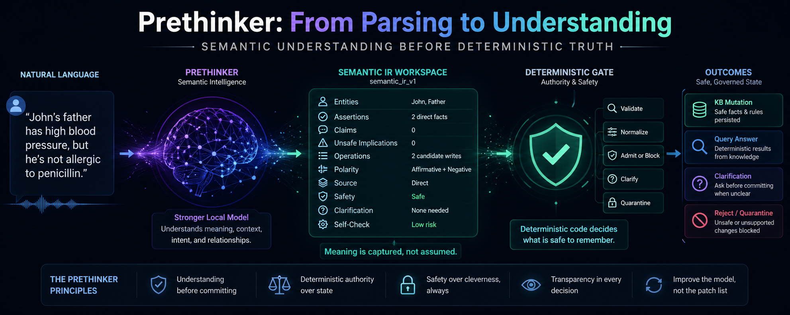

# Prethinker

**A governed write layer between natural language and a deterministic knowledge base.**

Prethinker is a governed semantic-intake layer for turning natural-language claims into auditable symbolic state.

The core bet is simple: **the model may propose, but deterministic code decides what becomes truth**. A capable LLM builds a rich semantic workspace from messy language; the mapper admits only candidate operations that survive schema, predicate-contract, provenance, and consistency checks; the Prolog KB remains the durable state layer.

This is not "English to Prolog by vibes." It is a research workbench for controlled memory admission: how much semantic understanding can a strong model contribute while a deterministic runtime prevents unsafe writes, ambiguity collapse, and claim/fact confusion?

Current center: a live `ui_gateway` console backed by `src/mcp_server.py`, the two-pass `semantic_router_v1 -> semantic_ir_v1` runtime path with `qwen/qwen3.6-35b-a3b`, profile-aware admission, scoped Epistemic Worlds diagnostics, and three starter domain lanes: bounded medical/UMLS, CourtListener legal-source intake, and SEC/contracts obligation intake.



## Read First

- [Docs and evidence hub](https://dr3d.github.io/prethinker/) - public docs, run reports, and current research map.
- [Current research headline](https://github.com/dr3d/prethinker/blob/main/docs/CURRENT_RESEARCH_HEADLINE.md) - the latest compact lab note.
- [Full design explainer](https://github.com/dr3d/prethinker/blob/main/docs/EXPLAINER.md) - the short conceptual tour.
- [Project state](https://github.com/dr3d/prethinker/blob/main/PROJECT_STATE.md) - compact status snapshot for the repo as it sits now.
- [Public docs guide](https://github.com/dr3d/prethinker/blob/main/docs/PUBLIC_DOCS_GUIDE.md) - reading order for deeper technical material.

## Current Research Headline

The active frontier is **semantic parallax**: one compile is one viewpoint.
Prethinker is testing whether multiple constrained semantic lenses over the
same source can build a richer symbolic surface than a single giant pass, while
keeping the authority boundary intact.

The current hard fixture is **Glass Tide**, a dense charter/rule-ingestion case.
Broad compiles preserve rules as source records; separate rule lenses can admit
executable clauses; runtime trials now expose the real frontier, which is
overgeneralized rule fanout, clean but dormant rules whose bodies lack matching
admitted facts, and exception branches that only show up under positive/negative
probes.

For the freshest orientation, read the
[current headline](https://github.com/dr3d/prethinker/blob/main/docs/CURRENT_RESEARCH_HEADLINE.md)
and then the
[multi-pass compiler note](https://github.com/dr3d/prethinker/blob/main/docs/MULTI_PASS_SEMANTIC_COMPILER.md).

## Current State

Read [PROJECT_STATE.md](https://github.com/dr3d/prethinker/blob/main/PROJECT_STATE.md) first. It is the compact, current orientation document for the repo.

The short version:

- `process_utterance()` is the canonical runtime entrypoint.
- The UI is a manual demonstration cockpit, not a marketing page.
- `semantic_ir_v1` is the active architecture pivot: stronger model semantics before deterministic admission.
- The console defaults to the current LM Studio `qwen/qwen3.6-35b-a3b` Semantic IR lane for manual research runs.
- `medical@v0` is the main bounded domain profile.
- UMLS is used as a bounded normalization and semantic-type bridge, not as a giant preloaded clinical encyclopedia.
- The active Semantic IR path passes `medical@v0` predicate contracts and compact UMLS concept context into the model input before deterministic admission.
- A thin profile roster now exposes skill-like domain packages such as `medical@v0`, `story_world@v0`, and `probate@v0`; only explicitly selected thick context affects the current Semantic IR pass.
- `active_profile=auto` now uses `semantic_router_v1` to select a cataloged profile per turn and load that profile's thick context/contracts into the Semantic IR call without granting write authority.
- `scripts/run_profile_bootstrap.py`, `scripts/run_domain_bootstrap_file.py`, and `scripts/run_profile_bootstrap_loop.py` are the current meta-profile experiments: the model proposes entity types, predicates, contracts, risks, intake passes, and starter cases for unfamiliar material; review loops and ordinary mapper admission decide whether the proposed surface is useful.
- `scripts/run_mixed_domain_agility.py` randomizes Goldilocks, Glitch, Ledger, Silverton, Harbor, CourtListener, SEC/contracts, and medical turns through `active_profile=auto` as a cross-domain agility pressure gauge.
- `legal_courtlistener@v0` and `adapters/courtlistener/` are the legal-source profile/adapter lane for claim/finding, citation, docket, role-scope, provenance, and identity-boundary experiments.
- `sec_contracts@v0` and `adapters/sec_edgar/` are the third large starter domain, aimed at obligations, conditions, temporal triggers, party roles, and filing/exhibit provenance.
- Epistemic Worlds v1 preserves projection-blocked and supported-but-skipped candidate writes as scoped diagnostics, without asserting them as global truth.
- The Prolog KB is the committed truth layer; model output remains provisional until the runtime admits it.
- Long story-like utterances can now be segmented into focused Semantic IR passes so narrative ingestion stays inspectable instead of relying on one summary-shaped model response.
- Historical reports, old prompt snapshots, and run logs were pruned from the forward-facing tree because Git already preserves them.

## Useful Entry Points

- [docs/EXPLAINER.md](https://github.com/dr3d/prethinker/blob/main/docs/EXPLAINER.md) - what Prethinker is and why the authority boundary matters.
- [Docs hub](https://dr3d.github.io/prethinker/) - GitHub Pages index for public docs and evidence.
- [PROJECT_STATE.md](https://github.com/dr3d/prethinker/blob/main/PROJECT_STATE.md) - current architecture, demo status, and next frontiers.
- [docs/CURRENT_RESEARCH_HEADLINE.md](https://github.com/dr3d/prethinker/blob/main/docs/CURRENT_RESEARCH_HEADLINE.md) - current research headline and newest public framing.
- [docs/MULTI_PASS_SEMANTIC_COMPILER.md](https://github.com/dr3d/prethinker/blob/main/docs/MULTI_PASS_SEMANTIC_COMPILER.md) - semantic parallax and safe-surface accumulation.
- [docs/CLARIFICATION_EAGERNESS_STRATEGY.md](https://github.com/dr3d/prethinker/blob/main/docs/CLARIFICATION_EAGERNESS_STRATEGY.md) - ingestion/query clarification policy and the CE Trap fixture.
- [AGENT-README.md](https://github.com/dr3d/prethinker/blob/main/AGENT-README.md) - fast onboarding for coding agents.
- [docs/CURRENT_UTTERANCE_PIPELINE.md](https://github.com/dr3d/prethinker/blob/main/docs/CURRENT_UTTERANCE_PIPELINE.md) - current domain-aware, recent-context, KB-seeded utterance path.
- [docs/CONTEXT_CONTROL_ARCHITECTURE_BRIEF.md](https://github.com/dr3d/prethinker/blob/main/docs/CONTEXT_CONTROL_ARCHITECTURE_BRIEF.md) - broader router/context-control architecture and near-future direction.
- [docs/PRETHINK_GATEWAY_MVP.md](https://github.com/dr3d/prethinker/blob/main/docs/PRETHINK_GATEWAY_MVP.md) - live gateway shape.
- [docs/PUBLIC_DOCS_GUIDE.md](https://github.com/dr3d/prethinker/blob/main/docs/PUBLIC_DOCS_GUIDE.md) - current public-doc reading map.
- [docs/SEMANTIC_IR_RESEARCH_DIRECTION_REPORT.md](https://github.com/dr3d/prethinker/blob/main/docs/SEMANTIC_IR_RESEARCH_DIRECTION_REPORT.md) - why the project pivoted from parser rescue to semantic workspace.
- [docs/SEMANTIC_IR_MAPPER_SPEC.md](https://github.com/dr3d/prethinker/blob/main/docs/SEMANTIC_IR_MAPPER_SPEC.md) - deterministic mapper/admission contract.
- [docs/DOMAIN_PROFILE_CATALOG.md](https://github.com/dr3d/prethinker/blob/main/docs/DOMAIN_PROFILE_CATALOG.md) - profile/skill-style context packages for domain-aware Semantic IR.
- [docs/DOMAIN_BOOTSTRAPPING_META_MODE.md](https://github.com/dr3d/prethinker/blob/main/docs/DOMAIN_BOOTSTRAPPING_META_MODE.md) - hint-free predicate/profile discovery from representative text or raw documents.
- [docs/COURTLISTENER_DOMAIN.md](https://github.com/dr3d/prethinker/blob/main/docs/COURTLISTENER_DOMAIN.md) - CourtListener legal-source domain notes and first smoke findings.
- [docs/SEC_CONTRACTS_DOMAIN.md](https://github.com/dr3d/prethinker/blob/main/docs/SEC_CONTRACTS_DOMAIN.md) - SEC/contracts domain notes and first smoke findings.
- [docs/UMLS_MVP.md](https://github.com/dr3d/prethinker/blob/main/docs/UMLS_MVP.md) - UMLS bridge and Semantic Network work.
- [docs/MEDICAL_PROFILE.md](https://github.com/dr3d/prethinker/blob/main/docs/MEDICAL_PROFILE.md) - bounded medical profile.
- [docs/CONSOLE_TRYBOOK.md](https://github.com/dr3d/prethinker/blob/main/docs/CONSOLE_TRYBOOK.md) - prompts for manual demos.
- [ui_gateway/README.md](https://github.com/dr3d/prethinker/blob/main/ui_gateway/README.md) - UI gateway notes.

## Run It

```powershell
python -m pytest -q
python ui_gateway/main.py
```

Open `http://127.0.0.1:8765` for the live console.

## Reproducibility Notes

The public repo currently tracks `41` pytest files under [tests/](https://github.com/dr3d/prethinker/tree/main/tests). Latest lean local full-suite verification:

```powershell
python -m pytest -q
# 389 passed
```

Current high-signal evidence:

- Semantic IR edge runtime A/B: `20/20` decision labels, `0.976` average score, `0` non-mapper parse rescues.
- Weak-edge pass: `10/10` decision labels, `1.000` average score.
- Multilingual router probe: `10/10` router choices and `10/10` compiler JSON on raw Spanish, French, German, Portuguese, Italian, Japanese, and code-switched turns.
- Profile-owned predicate aliases now canonicalize candidate-operation predicate surfaces before palette admission, with an audit trail such as `dad_of/2 -> parent/2`; this is registry/context authority, not Python prose parsing.
- Lava v5 latest 60-attempt rerun: `60/60` parsed JSON, `60/60` domain selector, `60/60` admission-safe, `45/60` semantic-clean, `41/60` full expectation score, `0/60` temp-0 signature variance groups, and `0` fuzzy edge kinds.
- Policy/reimbursement cross-turn demo: English policy installed executable rules, derived query answers without writing derived `violation/2` facts, then corrected state and changed the answer.
- Anaplan Polaris enterprise-guidance fixture: multi-support safe-surface accumulation reached `42 exact / 1 partial / 0 miss` on a 43-question post-ingestion QA battery, with `0` runtime load errors and `0` QA write proposals.
- Temporal kernel slice: admitted `before/2` facts now support deterministic `after/2`, transitive `precedes/2`, and `follows/2` queries through Prolog rules; `temporal_graph_v1` remains proposal-only unless matching candidate operations pass admission.
- Temporal correction guard: replacement `event_on/2`, `interval_start/2`, and `interval_end/2` anchors are blocked unless the model emits an explicit retract/correction plan.

The UMLS Semantic Network and Metathesaurus-derived runtime assets are intentionally not committed because they depend on licensed source data. The public repo includes the builders, tests, docs, and profile code; outside reproduction of the UMLS lane requires obtaining the licensed UMLS files separately.

## Repository Hygiene

Large licensed or generated assets live under ignored local paths, especially `tmp/licensed/umls/2025AB/`. The repo should keep source code, compact docs, profiles, tests, and small durable fixtures. Do not commit full UMLS archives, extracted Metathesaurus tables, run dumps, caches, coverage HTML, or throwaway reports.

## About The Author

Prethinker is built by Scott Evernden (`dr3d`), a retired software engineer who has been working in and around the symbolic AI tradition since 1980.

Scott first encountered Prolog at Digital Equipment Corporation in 1980 and became DEC's internal evangelist for the language. A friend he turned onto Prolog, Peter Gabel, later founded Arity Corporation, one of the canonical commercial Prolog implementations of the PC era. Scott ported SB-Prolog to the Amiga in 1986, working at the level of the Warren Abstract Machine, and lived through the expert-systems winter as a working symbolic programmer.

His earlier career includes computer graphics work at MIT's Architecture Machine Group under Nicholas Negroponte, Fortran libraries for one of the earliest commercial color inkjet plotters at Applicon, graphics terminal software at DEC, and foundational architecture work as employee #6 at Applix, later acquired by Cognos and then IBM. He later worked at Network Integrity / LiveVault, acquired by Iron Mountain, and briefly came out of retirement in 2019 as a Principal AI Engineer at Cantina Consulting in Boston.

Prethinker is partly a return to older logic-programming instincts through the lens of modern local LLMs. The lesson behind the project is that inference engines can be sharp; knowledge acquisition and truth admission are where systems often fail. This project asks whether a strong neural model can help acquire meaning while durable truth stays behind an explicit symbolic gate.
