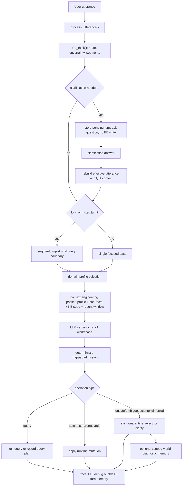

# Current Utterance Pipeline

Last updated: 2026-04-28

This is the current live path for a user utterance in Prethinker. The older
English-first parser lane is historical context only and now lives in Git
history rather than the public reading path.

The current center is better described as:

```text
utterance + recent context + selected domain profile + compact KB seed
  -> semantic_ir_v1 workspace
  -> deterministic mapper/admission
  -> query, clarification, quarantine, rejection, or durable KB mutation
```

The research problem is now mostly **context engineering under an authority
boundary**. The LLM is given enough relevant context to form a strong semantic
workspace, but it never receives write authority. The mapper and runtime still
decide what becomes Prolog state.

## One-Turn Overview

1. The UI or harness sends one utterance to `process_utterance()`.
2. `pre_think()` builds the front-door packet: route, uncertainty,
   clarification pressure, segment plan, and execution protocol.
3. Long or mixed utterances may be split into focused segments, especially at
   query boundaries.
4. The runtime uses `semantic_router_v1` to select a domain profile when
   `active_profile=auto`.
5. The runtime builds a compact Semantic IR input: utterance, recent turn
   context, profile context, allowed predicates, predicate contracts, and a
   small `kb_context_pack`.
6. The model emits a `semantic_ir_v1` workspace.
7. The deterministic mapper projects that workspace into admissible operations
   and diagnostics.
8. Projection-blocked writes may be preserved as scoped epistemic-world
   diagnostics, not global truth.
9. The runtime validates and applies only admitted operations.
10. The turn outcome is remembered, traced, and displayed in the UI.

## Diagram



## Step By Step

### 1. The canonical entrypoint receives the utterance

The live console, scripts, and tests are supposed to enter through
`process_utterance()`. This matters because the same route handles UI turns,
clarification answers, Semantic IR compilation, deterministic admission, KB
mutation, query execution, and trace collection.

Resetting a session clears pending clarification state, recent runtime memory,
trace state, and the runtime KB state for the live cockpit.

### 2. The front door decides route and risk

`pre_think()` builds a front-door packet before the heavier semantic compiler
work. It estimates whether the utterance is a write, query, mixed turn, or
context-only turn. It also computes clarification pressure and extracts a rough
segment plan.

This is not the final truth decision. It is the first routing layer that decides
whether the system should proceed, stop for clarification, or prepare a
multi-step execution protocol.

### 3. Clarification can stop the turn before parsing

If the front door sees an unsafe missing referent, vague patient identity,
unclear lab target, unresolved alias, or similar ambiguity, the runtime returns a
clarification request and does not compile or mutate the KB.

When the user answers, the pending turn is resumed. The clarification question
and answer become part of the effective utterance for the Semantic IR pass, so
the model sees the user-resolved context instead of guessing.

The current pipeline does this context work inside the primary Semantic IR pass:
recent context, profile context, predicate contracts, and KB seed context are
assembled before deterministic admission.

### 4. Long utterances are segmented into focused passes

Narrative or mixed turns can be split into smaller Semantic IR passes. The
segmenter looks for clauses and query boundaries so queries do not pile up in
the same semantic workspace as surrounding fact ingestion.

The important execution protocol is:

```text
segment_utterance
ingest_until_query_boundary
clarify_if_needed_before_query
commit_ingest
run_query
resume_next_segment
```

For a story, this lets the runtime ingest stable observations segment by segment
instead of asking one model call to summarize the whole narrative into final
facts. For a mixed fact/query turn, it keeps the mutation and the question
separable.

### 5. A domain profile is selected

The current pipeline can run with a fixed profile or `active_profile=auto`.
Auto-selection uses `semantic_router_v1` plus the thin profile roster to choose
a domain context such as:

- `medical@v0`
- `legal_courtlistener@v0`
- `sec_contracts@v0`
- `story_world@v0`
- `probate@v0`

This is a skill-directory-style mechanism. A profile can supply extra context,
predicate contracts, allowed predicates, and profile-owned validators. It does
not grant the model write authority.

If a turn genuinely mixes domains, the current safest shape is to segment the
turn so each focused pass can receive the right profile context.

For speed, pinned profiles skip the router entirely. In `active_profile=auto`,
the router receives the full thin profile roster, but the Semantic IR compiler
receives only a focused roster containing the selected profile and close
candidates. Exact router selections are cached for replay/retry paths with the
same utterance and context signature. These are context-engineering speedups;
they do not change mapper authority or add Python-side language interpretation.

### 6. The Semantic IR input is assembled

This is the core context-engineering step. The model does not simply receive the
raw utterance. The runtime assembles a compact prompt payload containing:

- the current utterance or focused segment
- recent semantic context from previous accepted turns
- the selected domain profile and thick profile context
- the thin roster of available profiles
- allowed predicate signatures
- predicate contracts with argument roles
- profile-owned admission guidance
- model/runtime options
- a compact `kb_context_pack`

The `kb_context_pack` is deliberately small. It is not a full KB dump and not a
general RAG answer. It gives the model useful current-state visibility:

- relevant exact clauses from the KB
- likely functional current-state candidates
- subject/predicate candidates for correction and conflict checks
- entity candidates
- recent committed logic
- a tiny fallback KB snapshot
- policy guidance for how to use this context

The model may use this to notice corrections, conflicts, aliases, pronouns, and
claim-vs-observation pressure. The mapper still controls truth.

### 7. The model proposes `semantic_ir_v1`

The active research model is usually the LM Studio/OpenAI-compatible structured
output path with `qwen/qwen3.6-35b-a3b`.

The model emits a structured workspace, not direct KB writes. The workspace can
include:

- entities and normalized candidates
- referents and ambiguity notes
- assertions and speech acts
- candidate operations
- source labels such as direct, claim, observed, context, or inferred
- polarity and safety labels
- unsafe implications
- clarification questions
- `truth_maintenance` proposals such as support links, conflicts, retraction
  plans, and derived consequences
- self-check/risk notes

The model's top-level decision is advisory. Durable effects must come through
candidate operations that pass deterministic admission.

### 8. The mapper admits, skips, or projects operations

The mapper is the hard gate. It checks candidate operations against generic
structure and profile-owned contracts.

Typical checks include:

- JSON/schema shape
- allowed predicate palette
- predicate arity
- predicate argument roles
- placeholder/null argument guard
- source and safety policy
- direct-vs-inferred writes
- claim/fact separation
- context-sourced write blocking
- negative fact policy
- rule admission policy
- temporal sanity, such as inverted intervals
- stored-logic conflict checks
- duplicate candidate collapse
- profile validators such as allegation-not-finding or obligation-not-breach

This is where the authority boundary lives. The LLM can describe what it thinks
is happening; the mapper decides what is admissible.

If the mapper projection blocks an otherwise structured write because the whole
turn must reject, quarantine, or clarify, the candidate can be copied into
Epistemic Worlds v1 diagnostics. These use fixed wrapper predicates such as:

```prolog
world_operation(reject_world, op_0, taking, fact).
world_arg(reject_world, op_0, 1, priya).
world_arg(reject_world, op_0, 2, warfarin).
world_policy(reject_world, op_0, reject).
```

That is scoped memory, not domain truth. It records "the system saw this
candidate and refused to assert it globally" without creating
`taking(priya, warfarin).`

### 9. The runtime applies admitted operations

Admitted operations are translated into runtime actions:

- `assert_fact` adds durable facts.
- `retract_fact` removes targeted old facts, usually for corrections.
- `assert_rule` can add durable rules only when the rule path is explicitly
  admitted.
- `query_rows` runs a query against the current KB.

Corrections are handled as mutation plans: retract the stale fact, then assert
the replacement. Queries remain queries; they should not become writes. Some
research runners record admitted queries without executing them by default so
broad sweeps cannot stall in recursive toy-Prolog search.

There are limited runtime fallbacks, such as a narrow no-result query fallback
for certain `lives_in` shapes. These should remain small, visible, and
explainable, not a new pile of hidden English repairs.

### 10. The UI and trace expose what happened

The console turns the result into debug bubbles and ledger rows:

- route and profile
- model/backend/options
- ambiguity and clarification state
- Semantic IR workspace summary
- admitted and skipped operations
- skip reasons
- mutations applied
- query rows or query plans
- truth-maintenance diagnostics
- epistemic-world scoped-memory diagnostics for rejected or quarantined
  candidate writes
- compact trace JSON for deeper inspection

The purpose of the UI is not just to show an answer. It is to let a human watch
the system decide what it was willing to believe.

## What Becomes Durable?

| Proposal shape | Normal outcome |
| --- | --- |
| Safe direct fact with valid predicate contract | Admit and assert |
| Targeted correction with old KB support | Retract old fact, assert replacement |
| Query | Execute or record as query, not a write |
| Claim from a speaker or document | Store as claim only if the profile palette supports it |
| Party allegation | Claim, not finding |
| Citation | Citation, not endorsement |
| Obligation | Obligation, not completed event |
| Inferred write | Usually skip or quarantine |
| Context-sourced write | Usually skip |
| Unsafe implication | Skip, quarantine, or clarify |
| Projection-blocked structured write | Preserve in scoped-world diagnostics; do not assert domain fact |
| General negative fact | Skip until negation semantics are explicit |
| Rule candidate | Admit only through the explicit rule path and policy checks |
| Ambiguous referent | Clarify or quarantine |

## What Counts As A Retry?

The current runtime does not blindly retry until the model says something
convenient. The retry-like paths are controlled:

- Clarification resume: ask the user, then rerun the semantic pass with the
  resolved Q/A context.
- Segmented ingestion: process the next focused segment only after the current
  segment is admitted, skipped, queried, or clarified.
- Structured-output failure: surface a compiler/parse failure instead of
  trusting malformed output.
- Research variance checks: harnesses may repeat temperature-0 runs to measure
  output stability, but that is evaluation, not hidden production repair.

This keeps failures inspectable. The system can improve its context packet,
domain profile, predicate contracts, or mapper policy without silently
papering over a bad proposal.

## Current Research Frontiers

- Better context selection under a small context window.
- Clearer profile selection for mixed-domain turns.
- More reusable predicate contracts and profile validators.
- Richer temporal fact representation after admission.
- Safer durable rule admission.
- Better truth-maintenance support links and conflict handling.
- UI traces that make every context source, model proposal, skip reason, query,
  and mutation easy to inspect.

The architectural line stays the same:

```text
soft semantic workspace proposes meaning
deterministic admission decides truth
the KB stores only admitted state
```
