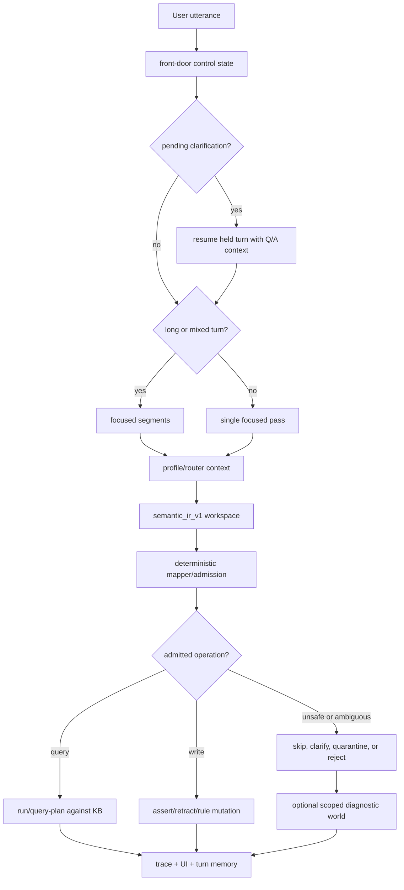
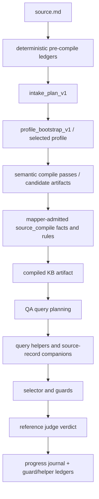

# Current Utterance And Document Pipeline

Last updated: 2026-05-10

This is the current live shape of Prethinker. The old English-first parser lane
is historical context. The current instrument is a governed adapter: language
proposes meaning, deterministic admission decides what becomes durable state,
and query helpers make admitted state retrievable without granting the model
write authority.

The project now has two closely related paths:

```text
interactive utterance
  -> semantic_ir_v1 workspace
  -> deterministic mapper/admission
  -> durable KB mutation, query, clarification, quarantine, or rejection

document source
  -> deterministic source-address ledgers
  -> intake/profile/bootstrap passes
  -> semantic compile candidates
  -> mapper-admitted KB artifact
  -> query helpers + selector/guards during QA
```

The LLM is still a stenographer and semantic instrument. It reads language,
proposes structure, and answers against query evidence. It is not the authority
that decides what the KB believes.

## Evaluated Artifact Unit

For document work, the evaluated artifact is:

```text
source + lens set + deterministic ledgers + admitted predicates + helper set
```

Helpers are part of the instrument's epistemic surface, not invisible plumbing.
Two runs over the same source can have different answerable surfaces if they use
different lens sets or helper sets. The helper classification and reporting
discipline live in
[`ARTIFACT_UNIT_AND_HELPER_CLASSIFICATION.md`](ARTIFACT_UNIT_AND_HELPER_CLASSIFICATION.md).

## Architecture In Five Lines

```text
compiled KB = durable state
row = measured encounter with that state
selector = chooses the best encounter surface
guard = prevents a tempting wrong surface
verdict = records what happened
```

Truth lives in the compiled KB, not in the row. A row is one measured
question/answer encounter with that state: one question, one reference answer,
one attempt, one verdict, and the query evidence used to judge it.

## Current Element Types

The instrument currently distinguishes several kinds of moving parts:

| Element | Role |
| --- | --- |
| Semantic IR | Model-owned workspace for utterance meaning, candidate operations, uncertainty, and truth-maintenance proposals. |
| Mapper/admission | Deterministic gate that admits, skips, rejects, quarantines, or clarifies operations. |
| Domain profile | Predicate palette, contracts, validators, and profile context for a domain. |
| Lens | LLM-driven reading strategy for a specific semantic surface. Current roster is treated as 13 active/candidate lenses. |
| Pre-compile ledger | Deterministic source-address extraction before LLM compile: line numbers, headings, table rows, fields, labels, IDs, and exact row text. |
| Helper/companion | Query-only substrate that joins admitted facts and source-record rows into answerable support tables. |
| Selector | Row-level choice among available candidate artifacts or query surfaces. |
| Guard | Named selector-time warning that prevents a broad but wrong surface from beating a narrow correct one. Current guard rollup remains 7 families with 0 unclassified. |
| Constraint propagation | Deterministic narrowing of known state and degrees of freedom after admission. |

Lenses propose semantic surfaces. Pre-compile ledgers preserve lexical and
structural addressability. Helpers make admitted state computable and
queryable. Guards and selectors decide which already-built surface should answer
one row.

## Live Utterance Path

The interactive route still enters through `process_utterance()`.



The Semantic IR input contains the current utterance or segment, recent context,
profile context, allowed predicates, predicate contracts, a compact KB context
pack, and strategy guidance. The model may propose entities, referents,
assertions, operations, source labels, unsafe implications, clarification
questions, `truth_maintenance`, and temporal graph notes.

The mapper admits only operations that pass structure, palette, arity, source,
safety, contract, conflict, correction, temporal, and profile checks. Projection
blocked material can be preserved in scoped diagnostic worlds, but that is not
domain truth.

## Document Compile Path

The research harness compiles documents into inspectable KB artifacts. The
current path is:



The compile output is the research object: Prolog/JSON state, admitted facts,
admitted rules, manifest, diagnostics, and source-record addressability. QA
rows measure whether that state can answer hostile questions under pressure.

## Deterministic Source Addressability

The pre-compile ledger category is now first-class.

`src/source_record_ledger.py` extracts line-numbered document structure without
interpreting meaning:

- headings and section labels
- table rows and column headers
- `source_record_field(Row, Header, Value)` facts
- bullet/list rows
- labeled prose rows
- blockquoted memo metadata rows (`From`, `To`, `Date`, `Re`)
- continuation lines for official procedural prose
- numeric tokens
- exact text atoms and stable text keys

These facts are source addressability only. They do not assert ownership,
authority, causality, counts, status, or truth. They let the compiler and QA
helpers point at exact printed rows and preserve exact strings such as document
IDs, appeal IDs, memo IDs, catalog IDs, roster sections, timestamps, and source
labels.

The archival identifier ledger/pinboard is the same design pattern at the
lexical layer: deterministic extraction of exact identifiers before the LLM can
paraphrase or normalize them.

## Query Helpers And Companions

Helpers are query-only substrate over admitted state. They do not read source
prose directly and do not mutate the KB. Current active examples include:

- `roster_state_support`: derives group membership, roster versions, counted
  adults, excluded adults, adult manifest totals, compliance-log status, temporary
  assignments, and group counts from admitted roster predicates plus
  source-record rows. Its emitted rows carry `HelperClass`: admitted-predicate
  joins and generic source-record adult/compliance rows are `clean-helper`, while
  school-roster source-record student assignment parsing remains
  `candidate-helper`. That parser now handles both fresh transfer rows shaped
  like `v1/v2/v3`, `group_a/group_b/group_c`, and `s_###`, and sibling
  homeroom-table rows shaped like `v1_0/v1_3`, `7_a`, and `STU-####`. A new
  deterministic pre-compile ledger fact, `roster_table_member/4`, now captures
  explicit grouping/member table rows before the helper runs. The helper may
  consume those explicit rows as clean structural memory, while section/prose
  roster parsing stays candidate-helper. QA planning now prefers
  `roster_table_member/4` for homeroom membership/count questions when that
  predicate exists, but does not broaden the rule to all roster or compliance
  counts. Printed member labels are preserved separately with
  `roster_table_member_label/5` and `roster_table_member_alias/2` so exact
  labels such as `STU-1063 Vinokur` survive without becoming duplicate members.
  `roster_table_count_support` then derives entry counts, distinct normalized
  member counts, duplicate members, and group counts from those deterministic
  table rows.
- `grant_award_support`: derives award totals, eligible application sets,
  cap-applied applications, appeal pending status, recusal records, committee
  recusal vote counts, and corrected-score support from admitted grant facts and
  source-record fields. Its emitted rows carry `HelperClass`: award, cap,
  eligibility, field-recusal, appeal-window, committee-recusal vote-count,
  score-correction operational status, and appeal-pending status rows are
  `clean-helper` on the current transfer batch.
- `industrial_sensor_support`: derives sensor-register facts, raw-event-log
  counts, per-system event composition, corrected timeline intervals,
  maintenance tickets, lab sample logistics, packet IDs, and packet-scope
  exclusions from admitted source-record rows. Its emitted rows carry
  `HelperClass`: field/ledger-derived event, timestamp, computed-duration,
  packet-id, data-loss, lab-sample logistics, and system clock-authority rows
  are `clean-helper`. Refreshed artifacts whose source-record ledger preserves
  the root-cause refusal and operator-origin prose classify those rows as
  `clean-helper`; stale artifacts keep them candidate-labeled. Stated-duration
  exact-prose recognizers were retired when they duplicated computed-duration
  rows or overclaimed from truncated source atoms.
- `clinic_recall_support`: derives clinic abbreviations, manufacturer liaison
  identity, failure rates, cabinet/seal/key custody, verification procedure
  support, full device serial displays, pending-determination correspondence,
  and medical-director authority from admitted source-record rows. Its emitted
  rows carry `HelperClass`: source-record-field device/serial rows plus generic
  manufacturer-liaison, verification-procedure, acronym-derived clinic
  abbreviations, explicit glossary abbreviations, cabinet/seal range,
  failure-rate atoms, and visit-date ranges are `clean-helper` when the
  required source-record rows are present. Key-retainer identity and named
  medical-director authority are `clean-helper` on refreshed artifacts whose
  source-record ledger preserves blockquoted memo sender lines; stale artifacts
  keep those rows candidate-labeled.
- `source_record_packet_metadata_support`: surfaces exact packet IDs, policy
  IDs, appeal IDs, score correction memo IDs, recusal memo IDs, and device IDs.
  Its emitted rows now carry `HelperClass`: generic identifier/metadata rows are
  `clean-helper`, while packet-family facts such as physical retention
  locations, pending packet items, and role-scope notes remain
  `candidate-helper`.
- `source_record_section_display`: renders normalized section atoms such as
  `v_9_2_fall_2026_cycle_carryover` into human section labels.
- authority/custody helpers: join possession, legal title, access, custody, and
  source-record location rows. Their emitted rows carry `HelperClass`: generic
  object-custody, access-log, authorization, and recall-right joins are
  `clean-helper`, while older family-specific source-cell/text recognizers are
  `candidate-helper`.
- temporal helpers: expose clock-sync, pause-aware intervals, deadline-family
  siblings, and admitted timestamp support. `source_record_clock_sync_support`
  is labeled `clean-helper` because it derives exact last-successful sync dates
  from admitted source-record text/numeric rows without domain constants.
  `clear_sample_clock_pause_support` is also labeled `clean-helper` because it
  joins admitted counted segments, sampler-offline intervals, and rule
  exceptions without source-prose recognition.
- constraint propagation: narrows numeric and date-time domains with
  `less_than`, `less_equal`, `greater_than`, `greater_equal`, `before`,
  `before_or_equal`, `after`, `after_or_equal`, `at_or_before`, and
  `at_or_after`.

The key lesson from the May transfer fixtures is that many misses are not new
semantic lenses. They are cases where the KB already contains the material, but
the query layer needs a deterministic companion to compose it.

The newer helper audit adds an important constraint: helper-assisted scores must
name the helper class. Generic helpers and declared lens companions are part of
the architecture. Fixture-shaped helpers are candidate scars until rewritten
generically or transfer-proven on fresh sibling fixtures.

## Selector And Guard Discipline

The selector chooses the best encounter surface per row. A guard prevents a
tempting wrong surface from winning.

The current live rollup has 7 guard families and 0 unclassified guards. The
guard count is intentionally audited rather than prematurely parameterized.
Every guard should answer:

```text
What question/evidence mismatch does this prevent?
Can it transfer across fixtures?
Can a better compile surface or helper retire it?
```

The current guard audit buckets are:

- transfer guards: proven useful across unlike fixtures
- candidate guards: helped one surface, transfer pending
- scar guards: local repairs that should retire when upstream substrate improves

The healthy long-term motion is not infinite guard growth. It is helper and
ledger improvements retiring downstream selector scars.

## OpenRouter And Environment

OpenRouter is now an active research lane, not a future-only migration note.
Local POWER runs are still useful for high-water research, but OpenRouter is
fast enough for broad compile/QA sweeps and transfer tests.

Secrets live in `.env.local`, which is gitignored. The main compile, QA, batch,
selector, and Semantic IR call paths now bootstrap local environment values
instead of relying on `tmp/.secrets`.

Expected local variables:

```text
OPENROUTER_API_KEY=...
PRETHINKER_API_KEY=...
PRETHINKER_BASE_URL=https://openrouter.ai/api/v1
PRETHINKER_MODEL=qwen/qwen3.6-35b-a3b
```

The endpoint remains OpenAI-compatible. The architecture treats model/provider
variation as measurement data: durable surfaces should transfer; sensitive
surfaces such as exact string preservation get deterministic reinforcement.

## Current Evidence Pattern

Recent transfer work supports the current direction:

- Six fresh transfer fixtures cold on OpenRouter scored `177 / 10 / 53`
  over 240 rows, or 73.75% exact.
- `school_activity_roster_reconciliation` moved from `21 / 3 / 16` to
  a `candidate-helper` replay of `40 / 0 / 0` through deterministic
  roster/source-record helpers, not a new lens.
- `grant_exception_cap_matrix` targeted replay moved its known miss set to
  exact after grant award/source-record helpers; this is mixed
  `candidate-helper` evidence, and full replays exposed remaining OpenRouter
  parse/judge variance to keep watching.
- `industrial_sensor_clock_correction` moved from `30 / 2 / 8` cold to
  a `candidate-helper` replay of `39 / 1 / 0` through
  `industrial_sensor_support`, showing that corrected intervals, exact sensor
  IDs, maintenance tickets, and packet-scope exclusions were already present as
  durable source-record memory but needed a queryable helper surface.
- `clinic_device_recall_field_packet` moved from `31 / 0 / 9` cold to
  a `candidate-helper` replay of `40 / 0 / 0` through refreshed source-record
  facts plus `clinic_recall_support`, another proof that exact official row
  details can be durable and inspectable without adding a new semantic lens.
- The main weak surface is no longer “can the model understand the document?”
  It is often “did the admitted state become addressable, composable, and
  queryable at the exact row shape the question demands?”

This is the refocus: compile natural language into sharp durable memory, then
make that memory inspectable and queryable.

## What Becomes Durable?

| Proposal shape | Normal outcome |
| --- | --- |
| Safe direct fact with valid predicate contract | Admit and assert |
| Targeted correction with old KB support | Retract old fact, assert replacement |
| Query | Execute or record as query, not a write |
| Claim from speaker/document | Store as claim only when the profile supports it |
| Party allegation | Claim, not finding |
| Citation | Citation, not endorsement |
| Obligation | Obligation, not completed event |
| Inferred write | Usually skip or quarantine |
| Context-sourced write | Usually skip |
| Unsafe implication | Skip, quarantine, reject, or clarify |
| Projection-blocked proposal | Preserve in scoped diagnostics, not domain truth |
| Deterministic source-record row | Admit only as source addressability |
| Helper-derived support row | Query evidence only; no KB mutation |
| General negative fact | Skip until negation semantics are explicit |
| Rule candidate | Admit only through explicit rule path and policy checks |
| Ambiguous referent | Clarify or quarantine |

## Current Research Frontiers

- Cold acquisition improvements: preserve more exact official row structure
  before semantic compile.
- Helper depth: temporal intervals, supersession, count/composition, authority
  joins, grant/cap arithmetic, roster state, and source-reliability scoping.
- Constraint propagation: turn known state and degrees of freedom into
  spreadsheet-like deterministic narrowing.
- Selector discrimination: close the gap between available candidate ceiling
  and chosen answer surface.
- Guard audit and retirement: merge duplicates and retire scars made obsolete
  by stronger upstream substrate.
- Model transfer: use OpenRouter/POWER drift to identify which surfaces are
  durable and which need deterministic side channels.

The architectural line stays the same:

```text
language proposes
admission governs
state records
helpers may compute
selectors choose surfaces
dependencies stay visible
```
