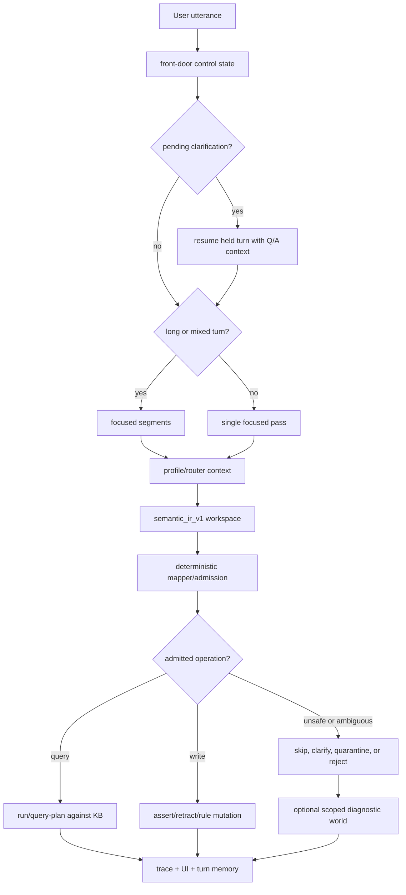
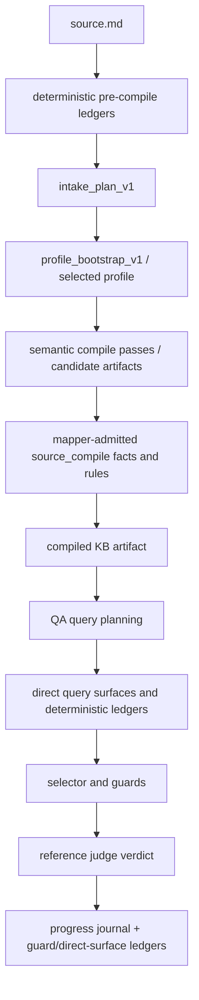

# Current Utterance And Document Pipeline

Last updated: 2026-05-16

This is the current live shape of Prethinker. The old English-first parser lane
is historical context. The current instrument is a governed adapter: language
proposes meaning, deterministic admission decides what becomes durable state,
and no-helper query planning tries to retrieve admitted state without granting
the model write authority.

The project now has two closely related paths:

```text
interactive utterance
  -> semantic_ir_v1 workspace
  -> deterministic mapper/admission
  -> durable KB mutation, query, clarification, quarantine, or rejection

document source
  -> deterministic source-address ledgers
  -> intake/profile/bootstrap passes
  -> semantic compile candidates
  -> mapper-admitted KB artifact
  -> no-helper QA over direct compile surfaces + selector/guards
```

The LLM is still a stenographer and semantic instrument. It reads language,
proposes structure, and answers against query evidence. It is not the authority
that decides what the KB believes.

## Evaluated Artifact Unit

For document work, the evaluated artifact is:

```text
source + lens set + deterministic ledgers + admitted predicates + query policy
```

The current default query policy is no-helper: `--helper-companion-row-limit 0`.
Legacy helper adapters remain available only for forensic replay and old
artifact compatibility. Two runs over the same source can still differ if they
use different lens sets, ledgers, admitted predicate contracts, or query
policies, so those settings must be named in reports.

## Architecture In Five Lines

```text
compiled KB = durable state
row = measured encounter with that state
selector = chooses the best encounter surface
guard = prevents a tempting wrong surface
verdict = records what happened
```

Truth lives in the compiled KB, not in the row. A row is one measured
question/answer encounter with that state: one question, one reference answer,
one attempt, one verdict, and the query evidence used to judge it.

## Current Element Types

The instrument currently distinguishes several kinds of moving parts:

| Element | Role |
| --- | --- |
| Semantic IR | Model-owned workspace for utterance meaning, candidate operations, uncertainty, and truth-maintenance proposals. |
| Mapper/admission | Deterministic gate that admits, skips, rejects, quarantines, or clarifies operations. |
| Domain profile | Predicate palette, contracts, validators, and profile context for a domain. |
| Lens | LLM-driven reading strategy for a specific semantic surface. Current roster is treated as 13 active/candidate lenses. |
| Pre-compile ledger | Deterministic source-address extraction before LLM compile: line numbers, headings, table rows, fields, labels, IDs, and exact row text. |
| Query policy | Determines whether QA answers only from admitted/direct surfaces or also enables legacy forensic adapters. |
| Selector | Row-level choice among available candidate artifacts or query surfaces. |
| Guard | Named selector-time warning that prevents a broad but wrong surface from beating a narrow correct one. Current guard rollup has 4 active families with 0 unclassified. |
| Constraint propagation | Deterministic narrowing of known state and degrees of freedom after admission. |

Lenses propose semantic surfaces. Pre-compile ledgers preserve lexical and
structural addressability. The current compile-surface work pushes recurring
answer-bearing joins into admitted facts or deterministic ledgers. Guards and
selectors decide which already-built surface should answer one row.

## Live Utterance Path

The interactive route still enters through `process_utterance()`.



The Semantic IR input contains the current utterance or segment, recent context,
profile context, allowed predicates, predicate contracts, a compact KB context
pack, and strategy guidance. The model may propose entities, referents,
assertions, operations, source labels, unsafe implications, clarification
questions, `truth_maintenance`, and temporal graph notes.

The mapper admits only operations that pass structure, palette, arity, source,
safety, contract, conflict, correction, temporal, and profile checks. Projection
blocked material can be preserved in scoped diagnostic worlds, but that is not
domain truth.

## Document Compile Path

The research harness compiles documents into inspectable KB artifacts. The
current path is:



The compile output is the research object: Prolog/JSON state, admitted facts,
admitted rules, manifest, diagnostics, and source-record addressability. QA
rows measure whether that state can answer hostile questions under pressure.

## Deterministic Source Addressability

The pre-compile ledger category is now first-class.

`src/source_record_ledger.py` extracts line-numbered document structure without
interpreting meaning:

- headings and section labels
- table rows and column headers
- `source_record_field(Row, Header, Value)` facts
- bullet/list rows
- labeled prose rows
- blockquoted memo metadata rows (`From`, `To`, `Date`, `Re`)
- continuation lines for official procedural prose
- numeric tokens
- exact text atoms and stable text keys

These facts are source addressability only. They do not assert ownership,
authority, causality, counts, status, or truth. They let the compiler and QA
query planning point at exact printed rows and preserve exact strings such as document
IDs, appeal IDs, memo IDs, catalog IDs, roster sections, timestamps, and source
labels.

The archival identifier ledger/pinboard is the same design pattern at the
lexical layer: deterministic extraction of exact identifiers before the LLM can
paraphrase or normalize them.

## Query Surfaces And Legacy Adapters

The live measurement path is now no-helper by default. QA should first ask:

- did the compile emit the answer-bearing distinction as admitted state?
- did the deterministic ledger preserve the exact source coordinate, label,
  identifier, count, or table field needed to query it?
- did query planning bind the right admitted surfaces without rereading source
  prose?
- did selector/guard logic choose the right surface for this row?

Legacy helper adapters still exist in code for old artifact replay and forensic
comparison, but they are opt-in:

```text
--helper-companion-row-limit 0
--include-legacy-native-helper-adapters  # explicit forensic/compatibility mode
```

Those adapters are marked `legacy_native_compatibility_adapter` and
`default_delivery=disabled`. Their historical evidence and retirement trail
were retired from the public docs tree; Git history preserves the old worksheet.
New architecture should prefer direct admitted predicates and deterministic
ledger surfaces such as
`explicit_table_membership/4`, `explicit_table_member_label/5`,
`source_record_field/3`, source/authority predicates, temporal/status rows, and
role/assignment/statement predicates that are emitted by the compiler.

The active replacement lane is compile-surface stability: when a recurring
query-time join matters, the preferred repair is to make the compiler or ledger
emit a reusable, fixture-free surface directly.

## Selector And Guard Discipline

The selector chooses the best encounter surface per row. A guard prevents a
tempting wrong surface from winning.

The current live rollup has 7 guard families and 0 unclassified guards. The
guard count is intentionally audited rather than prematurely parameterized.
Every guard should answer:

```text
What question/evidence mismatch does this prevent?
Can it transfer across fixtures?
Can a better compile surface or deterministic ledger retire it?
```

The current guard audit buckets are:

- transfer guards: proven useful across unlike fixtures
- candidate guards: helped one surface, transfer pending
- scar guards: local repairs that should retire when upstream substrate improves

The healthy long-term motion is not infinite guard growth. It is direct
compile-surface and ledger improvements retiring downstream selector scars.

## OpenRouter And Environment

OpenRouter is now an active research lane, not a future-only migration note.
Local POWER runs are still useful for high-water research, but OpenRouter is
fast enough for broad compile/QA sweeps and transfer tests.

Secrets live in `.env.local`, which is gitignored. The main compile, QA, batch,
selector, and Semantic IR call paths now bootstrap local environment values
instead of relying on `tmp/.secrets`.

Expected local variables:

```text
OPENROUTER_API_KEY=...
PRETHINKER_API_KEY=...
PRETHINKER_BASE_URL=https://openrouter.ai/api/v1
PRETHINKER_MODEL=qwen/qwen3.6-35b-a3b
```

The endpoint remains OpenAI-compatible. The architecture treats model/provider
variation as measurement data: durable surfaces should transfer; sensitive
surfaces such as exact string preservation get deterministic reinforcement.

## Current Evidence Pattern

Recent transfer work supports the current direction:

- Six fresh transfer fixtures cold on OpenRouter scored `177 / 10 / 53`
  over 240 rows, or 73.75% exact.
- `school_activity_roster_reconciliation` exposed why legacy helper evidence
  had to become compile-surface work: the high-water was reachable, but the
  forward repair is direct assignment/table surfaces, not helper delivery.
- `count_composition_roster` now has a clean six-mode memory package with a
  `40 / 0 / 0` row-gated ceiling. Adding question-shape selector risk gates
  moved guarded selection from `31 / 3 / 6` to `40 / 0 / 0`, proving the
  residual was surface routing rather than missing compiled state.
- Grant, sensor, clinic, probate, and roster helper-era replays are now treated
  as archaeology: they show which distinctions were reachable, then CSS work
  decides which ones deserve direct compile or ledger surfaces.
- The main weak surface is no longer "can the model understand the document?"
  It is often "did the admitted state become addressable, composable, and
  queryable at the exact row shape the question demands?"

This is the refocus: compile natural language into sharp durable memory, then
make that memory inspectable and queryable.

## What Becomes Durable?

| Proposal shape | Normal outcome |
| --- | --- |
| Safe direct fact with valid predicate contract | Admit and assert |
| Targeted correction with old KB support | Retract old fact, assert replacement |
| Query | Execute or record as query, not a write |
| Claim from speaker/document | Store as claim only when the profile supports it |
| Party allegation | Claim, not finding |
| Citation | Citation, not endorsement |
| Obligation | Obligation, not completed event |
| Inferred write | Usually skip or quarantine |
| Context-sourced write | Usually skip |
| Unsafe implication | Skip, quarantine, reject, or clarify |
| Projection-blocked proposal | Preserve in scoped diagnostics, not domain truth |
| Deterministic source-record row | Admit only as source addressability |
| Legacy adapter-derived support row | Forensic query evidence only; no KB mutation |
| General negative fact | Skip until negation semantics are explicit |
| Rule candidate | Admit only through explicit rule path and policy checks |
| Ambiguous referent | Clarify or quarantine |

## Current Research Frontiers

- Cold acquisition improvements: preserve more exact official row structure
  before semantic compile.
- Direct compile-surface depth: temporal intervals, supersession,
  count/composition, authority joins, grant/cap arithmetic, assignment state,
  and source-reliability scoping.
- Constraint propagation: turn known state and degrees of freedom into
  spreadsheet-like deterministic narrowing.
- Selector discrimination: close the gap between available candidate ceiling
  and chosen answer surface.
- Guard audit and retirement: merge duplicates and retire scars made obsolete
  by stronger upstream substrate.
- Model transfer: use OpenRouter/POWER drift to identify which surfaces are
  durable and which need deterministic side channels.

The architectural line stays the same:

```text
language proposes
admission governs
state records
legacy adapters may compare
selectors choose surfaces
dependencies stay visible
```
