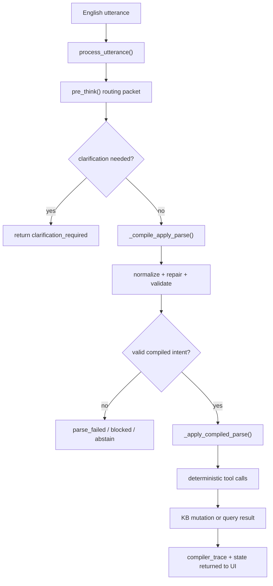

# GIC English Input Pipeline

Status note, 2026-04-26: this document remains useful for understanding the
legacy English-first pipeline and why the project accumulated Python-side
guardrails. The current research center is the stronger-model
`semantic_ir_v1` path described in
[docs/SEMANTIC_IR_RESEARCH_DIRECTION_REPORT.md](https://github.com/dr3d/prethinker/blob/main/docs/SEMANTIC_IR_RESEARCH_DIRECTION_REPORT.md).

This note is the technical follow-through of what `Prethinker` is doing today when an English utterance arrives at the canonical interactive front door.

It is written for knowledge engineers, systems people, and anyone who wants to understand where the language model stops, where the guardrails begin, and how a typed sentence becomes a KB mutation, query, or refusal.

## Executive Summary

`Prethinker` is not a raw “English to Prolog” model prompt.

It is a governed pipeline with 3 distinct layers:

1. a `qwen3.5:9b` model acting as a strict compiler
2. runtime wrappers that define the exact contract for the current pass
3. deterministic Python gates that normalize, validate, clarify, and apply

The important practical fact is:

- the model is allowed to propose structure
- the runtime is allowed to decide whether that structure may mutate state

That is the core of the Governed Intent Compiler idea.

## Scope Of This Note

This article describes the **current live interactive path**:

- browser console / UI
- MCP `process_utterance()`
- strict compiler mode
- `qwen3.5:9b`
- `Freethinker` policy `off`

This is not a hypothetical future architecture note. It is the current runtime path centered on:

- [src/mcp_server.py](../src/mcp_server.py)

And surfaced through:

- [ui_gateway/gateway/runtime_hooks.py](../ui_gateway/gateway/runtime_hooks.py)
- [ui_gateway/gateway/phases.py](../ui_gateway/gateway/phases.py)
- [ui_gateway/gateway/server.py](../ui_gateway/gateway/server.py)

## Current Language Claim

The current product/runtime should be understood as **English-first**.

That means:

- English is the real measured input language today
- English phrasing, possessives, compound family language, corrections, and temporal narration are where the runtime has learned specific behavior
- the architecture can later expand toward dialect-aware or multilingual variants
- but `v1` should not pretend to be language-universal

This matters because the pipeline contains English-specific seams:

- clause splitting
- pronoun/coreference hints
- family-bundle expansion
- inverse possessive rewrites
- English-oriented correction forms like `actually no, X is with A not B`

## The Entryway

The canonical interactive entryway is:

- [src/mcp_server.py](../src/mcp_server.py) `PrologMCPServer.process_utterance()`

The UI does not use a separate semantic engine anymore. It delegates into that same path:

- [ui_gateway/gateway/runtime_hooks.py](../ui_gateway/gateway/runtime_hooks.py) `RuntimeHooks.process_utterance()`

The same server path is also exposed through the project MCP server, which means:

- UI testing
- MCP testing
- and direct `process_utterance()` pressure

can all hit the same governed front door.

## High-Level Flow

That flow is simple on the surface, but the important behavior lives in the handoffs.

## What The 9B Actually Sees

One of the easiest mistakes is to imagine:

- system prompt
- plus utterance

That is not quite right.

In practice the model receives a **single wrapped prompt** for each pass:

- shared semantic doctrine
- exact pass-specific contract
- current utterance
- sometimes small contextual additions such as clarification replay

### Shared Prompt

The active shared semantic doctrine lives here:

- [modelfiles/semantic_parser_system_prompt.md](https://github.com/dr3d/prethinker/blob/main/modelfiles/semantic_parser_system_prompt.md)

This shared prompt is the stable constitutional guidance:

- relation/argument discipline
- recursion safety
- clarification norms
- uncertainty behavior
- semantic parsing style

It is not the whole runtime contract by itself.

### Runtime Wrappers

The runtime wraps that shared prompt with pass-specific instructions.

In the batch/runtime library:

- [kb_pipeline.py](../kb_pipeline.py) `_build_classifier_prompt()`
- [kb_pipeline.py](../kb_pipeline.py) `_build_extractor_prompt()`
- [kb_pipeline.py](../kb_pipeline.py) `_build_logic_only_extractor_prompt()`
- [kb_pipeline.py](../kb_pipeline.py) `_build_repair_prompt()`

In the interactive front door:

- [src/mcp_server.py](../src/mcp_server.py) `_build_compiler_prompt()`

These wrappers add things the shared prompt should not permanently own:

- exact required JSON keys
- route lock for this pass
- `logic_string` rules
- clarification field requirements
- repair-only constraints

So the real model input is:

- shared prompt
- plus exact wrapper contract
- plus current utterance

## Thinking Is Intentionally Disabled

This project does not want the model in free reasoning mode for the parser lane.

Two different mechanisms enforce that:

1. prompts prepend `/no_think`
2. the Ollama request explicitly sends `"think": false`

The actual model call helper is in:

- [kb_pipeline.py](../kb_pipeline.py) `_call_model_prompt()`

That helper also uses:

- `format: "json"`
- temperature `0`

So the parser lane is deliberately optimized for:

- one JSON object
- no reflective prose
- no hidden chain-of-thought becoming the public output

This matters because `qwen3.5:9b` behaves very differently with thinking on versus off. In this project, thinking-on is not just “less tidy.” It breaks the parser contract.

## Step 1: The Utterance Arrives

The front door starts in:

- [src/mcp_server.py](../src/mcp_server.py) `process_utterance()`

The first logic split is:

- fresh utterance
- or clarification answer for a pending turn

If the call includes a clarification answer, the server:

- verifies there is an active pending turn
- checks the `prethink_id`
- records the answer
- reuses the pending front-door context

If it is a fresh turn, `process_utterance()` calls:

- [src/mcp_server.py](../src/mcp_server.py) `pre_think()`

## Step 2: Pre-Think Builds A Routing Packet

`pre_think()` is not the final parse. It is the front-door decision packet.

Its job is to answer:

- what kind of thing is this?
- how uncertain is it?
- do we need clarification before we do anything risky?

### What `pre_think()` Uses

`pre_think()` combines:

- the model-driven routing packet
- lightweight English heuristics
- coreference hints
- turn segmentation
- session clarification policy

The model side is built through:

- [src/mcp_server.py](../src/mcp_server.py) `_build_compiler_prompt()`
- [src/mcp_server.py](../src/mcp_server.py) `_compile_prethink_semantics()`

The local context side is built through helpers like:

- `_build_coreference_hint()`
- `_build_turn_segments()`

### What The Pre-Think Packet Contains

The resulting packet includes:

- `prethink_id`
- mode such as `block_or_clarify`
- route signals
- compiler intent
- uncertainty score
- coreference hints
- clarification question/reason
- execution protocol outline

This is the point where an English utterance first becomes a governed object rather than just a string.

## Step 3: Pre-Think Sanitizes Its Own Clarifications

Even the routing packet is not trusted blindly.

The project already knows that the model can ask bad clarifications, such as:

- relation-family drift not present in the utterance
- internal predicate-mapping questions the user should never see
- silly requests for clarification where a shadow parse is already stable

That is why `pre_think()` runs through:

- [src/mcp_server.py](../src/mcp_server.py) `_sanitize_compiler_clarification()`

This stage can:

- suppress unsafe clarification
- rewrite the question
- or use a shadow parse to prove the turn can proceed without asking the user

If the primary pre-think packet fails badly, the server can also fall back to a smaller classifier path.

So even before the main parse, the pipeline is already:

- model proposal
- normalization
- rescue/fallback
- gated packet output

## Step 4: Clarify Or Proceed

If `pre_think()` says clarification is required, `process_utterance()` returns:

- `clarification_required`
- clarification question
- reasons
- compiler trace

No KB mutation happens yet.

If the user later answers, the answer is recorded through:

- [src/mcp_server.py](../src/mcp_server.py) `record_clarification_answer()`

Then `process_utterance()` is called again and continues with the same turn.

If no clarification is needed, or if it has been resolved, the system moves to full semantic extraction.

## Step 5: Full Parse / Extraction

The next major stage is:

- [src/mcp_server.py](../src/mcp_server.py) `_compile_apply_parse()`

This is where the current English utterance becomes a candidate Prolog structure.

### Effective Utterance

If clarification happened, the extractor does not receive only the original sentence.

It receives:

- original utterance
- clarification question
- clarification answer

concatenated into an “effective utterance.”

This is important because the current interactive path is not a full rolling transcript parser. It is mostly a current-turn compiler, with clarification replay stitched into the current turn when needed.

### Extraction Prompt

The extraction pass uses:

- [kb_pipeline.py](../kb_pipeline.py) `_build_extractor_prompt()`

That wrapper adds:

- route lock
- known-predicate hint slot
- exact JSON schema
- `logic_string` rules
- fact/rule/query field expectations
- uncertainty and clarification field rules

This is one of the places where the runtime contract is much stricter than the shared prompt alone.

## Step 6: Parse-Time Repair And Canonicalization

The parse output is still not trusted as final.

`_compile_apply_parse()` runs a small stack of repair/canonicalization passes before validation:

1. `clarification_fields_normalized`
2. `make_with_query_canonicalization`
3. `compound_family_augmentation`
4. `subject_prefixed_predicate_canonicalization`

Those are recorded in the trace and are intentionally visible because they answer an important scientific question:

- did the raw model succeed?
- or did Python rescue it?

### What These Repairs Mean

Examples:

- capability wording around ingredients can be mapped back onto the stored `made_with(...)` relation
- explicit family bundles can be expanded into deterministic family facts
- bad subject-prefixed predicates like `hope_lives_in(...)` can be canonicalized into `lives_in(...)`

These are not generic LLM reasoning. They are explicit runtime governance.

## Step 7: Structural Validation

After repair/canonicalization, the parse is validated through:

- [kb_pipeline.py](../kb_pipeline.py) `_validate_parsed()`

This is where malformed semantic structures are rejected.

It checks things like:

- schema completeness
- route consistency
- valid fact/rule/query shapes
- `logic_string` alignment
- proper clause formatting

If this stage fails, the utterance does not mutate the KB.

This is a major reason `Prethinker` is not just “whatever the model said.”

## Step 8: Deterministic Apply

If the parsed structure survives validation, `process_utterance()` calls:

- [src/mcp_server.py](../src/mcp_server.py) `_apply_compiled_parse()`

This is where intent is turned into tool-level deterministic operations:

- `assert_fact`
- `assert_rule`
- `retract_fact`
- `query_rows`

These operations go through:

- [src/mcp_server.py](../src/mcp_server.py) `tools_call()`

And that path still enforces:

- pre-think gate
- confirmation expectations
- query loop safety
- mutation accounting

The important architectural line is here:

- the model does not write the KB directly
- the runtime issues named deterministic operations against the KB

## Step 9: Trace Emission

The final returned object includes:

- front-door decision
- execution result
- compiler trace
- serialized state

The trace is one of the most important parts of the system for engineering honesty.

It records:

- pre-think source
- fallback usage
- Freethinker status
- parse rescues
- validation failures
- final admitted shape

So a turn is not just “answered.” It is inspectable.

## A Worked Example

Take a simple English write:

`Scott lives in Salem.`

At a high level, the live path is:

1. `process_utterance()` receives the string.
2. `pre_think()` classifies it as write-like with low ambiguity.
3. `_compile_apply_parse()` asks the model for a strict JSON parse under the `assert_fact` route lock.
4. Parse-time repair may canonicalize the predicate if the model emits a subject-prefixed variant.
5. Validation checks the resulting fact shape.
6. `_apply_compiled_parse()` issues `assert_fact`.
7. The deterministic KB records the admitted clause.
8. The UI receives the execution record plus compiler trace.

Now compare a correction form:

`Actually no, cart is with Mara not Scott.`

Today, this often goes wrong in one of 2 ways:

- front door invents ambiguity and asks a nonsense clarification question
- downstream parse treats the new holder as something to retract instead of assert

That is exactly the sort of frontier behavior we now measure through the correction pack rather than patching blindly.

## How English Is Being Treated

This project is not language-neutral in practice.

It is currently treating English as:

- clause-oriented
- relation-rich
- full of possessives and role inversions
- full of correction forms
- full of elliptical temporal narration

That means the runtime pays special attention to English phenomena like:

- `A is B's parent`
- `X's mom and dad are Y and Z`
- `actually no, X is with A not B`
- `at step 11 ... later moved ...`
- `next week ... later ...`

In other words, the system is not just “translating sentences.” It is trying to turn English discourse into a governed symbolic ledger.

## What The Model Is Good At Here

The 9B model is still doing meaningful work:

- route suggestion
- first-pass semantic structure
- clause extraction
- argument ordering
- basic clarification generation

But the model is not the whole system.

The final behavior often depends on:

- wrapper contract
- clarification sanitization
- parse repair/canonicalization
- validation
- deterministic apply

So the correct engineering description is:

`Prethinker` is a governed semantic compiler, not a naked model prompt.

## What Still Breaks

The hardest current English frontier families are now explicit:

- correction handling
- temporal sequencing

Correction still splits into:

- false ambiguity / nonsense clarification
- invalid retract / state corruption

Temporal still splits into:

- step-sequence parse/validation failure
- same-step contradiction flattening
- relative-time over-simplification
- temporal binding drift

Those are not abstract concerns. They are now frozen into replayable frontier packs under:

- [docs/data/frontier_packs](./data/frontier_packs)

## Why This Matters

If you are a knowledge engineer, the main thing to understand is this:

The project is not trying to prove that a 9B model “understands English” in some broad philosophical way.

It is trying to prove something narrower and more useful:

- that English utterances can be passed through a governed compiler
- that ambiguous ones can be stopped or clarified
- that valid ones can land in a KB through deterministic operations
- and that the whole chain remains inspectable

That is the practical meaning of a Governed Intent Compiler.

## Current Honest Conclusion

Today, `Prethinker` is best understood as:

- an English-first governed adapter
- with a strict 9B semantic compiler at the front
- wrapped by strong runtime contracts
- and made safe by deterministic validation and apply layers

It is not merely:

- a system prompt
- plus a model
- plus some vibes

It is a layered machine that treats English as input to a symbolic authority boundary.

That is the real shape of the project today.
